# 📚 Sistema de Registro e Inscripción ANIEI

## Descripción General

El **Sistema ANIEI** es una aplicación web desarrollada en **PHP** con **MySQL** para gestionar el registro de participantes e inscripciones a actividades del **Congreso Nacional de la ANIEI** (Asociación Nacional de Instituciones de Educación en Informática).

Este sistema permite:
- Registro de participantes (individuales o en grupos)
- Inscripción a actividades del congreso (talleres, conferencias, ponencias)
- Gestión de pagos y depósitos
- Control de acceso mediante códigos de barras
- Generación de reportes y constancias en PDF
- Panel de administración para gestionar usuarios y actividades

---

## 🏗️ Arquitectura del Sistema

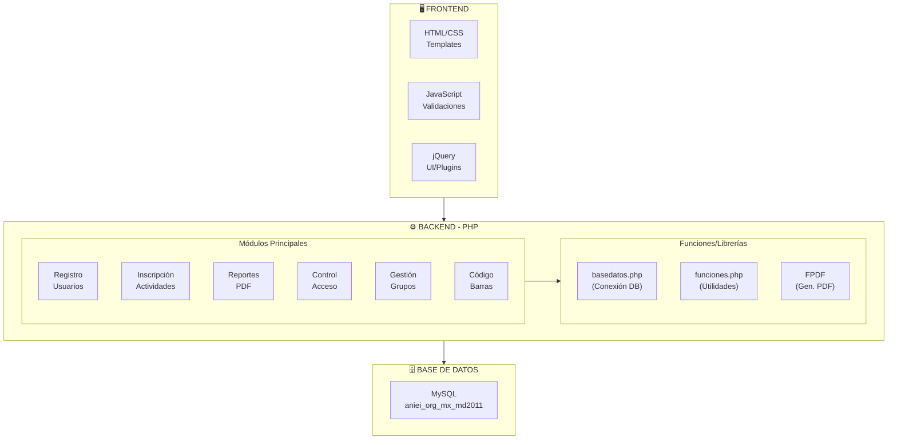
```mermaid
flowchart TB
    subgraph Frontend["🖥️ FRONTEND"]
        HTML["HTML/CSS<br/>Templates"]
        JS["JavaScript<br/>Validaciones"]
        JQ["jQuery<br/>UI/Plugins"]
    end

    subgraph Backend["⚙️ BACKEND - PHP"]
        subgraph Modulos["Módulos Principales"]
            REG["Registro<br/>Usuarios"]
            INS["Inscripción<br/>Actividades"]
            REP["Reportes<br/>PDF"]
            ACC["Control<br/>Acceso"]
            GRP["Gestión<br/>Grupos"]
            COD["Código<br/>Barras"]
        end
        
        subgraph Libs["Funciones/Librerías"]
            BD["basedatos.php<br/>(Conexión DB)"]
            FN["funciones.php<br/>(Utilidades)"]
            PDF["FPDF<br/>(Gen. PDF)"]
        end
    end

    subgraph Database["🗄️ BASE DE DATOS"]
        MySQL["MySQL<br/>aniei_org_mx_rnd2011"]
    end

    Frontend --> Backend
    Backend --> Database
    Modulos --> Libs
```

---

## 📂 Estructura de Directorios

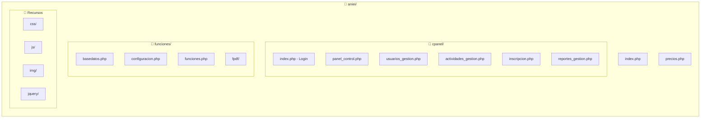
```mermaid
flowchart LR
    subgraph Root["📁 aniei/"]
        direction TB
        INDEX["index.php"]
        PRECIOS["precios.php"]
        
        subgraph CPANEL["📁 cpanel/"]
            direction TB
            CP_INDEX["index.php - Login"]
            CP_PANEL["panel_control.php"]
            CP_USERS["usuarios_gestion.php"]
            CP_ACT["actividades_gestion.php"]
            CP_INS["inscripcion.php"]
            CP_REP["reportes_gestion.php"]
        end
        
        subgraph FUNC["📁 funciones/"]
            direction TB
            F_BD["basedatos.php"]
            F_CONF["configuracion.php"]
            F_FN["funciones.php"]
            F_FPDF["fpdf/"]
        end
        
        subgraph ASSETS["📁 Recursos"]
            CSS["css/"]
            JS_DIR["js/"]
            IMG["img/"]
            JQ["jquery/"]
        end
    end
```

### Detalle de Archivos Principales

| Directorio | Archivo | Descripción |
|------------|---------|-------------|
| `/` | `index.php` | Página principal de bienvenida |
| `/` | `precios.php` | Información de precios y registro |
| `/cpanel` | `panel_control.php` | Dashboard de administración |
| `/cpanel` | `usuarios_gestion.php` | CRUD de usuarios |
| `/cpanel` | `actividades_gestion.php` | CRUD de actividades |
| `/cpanel` | `inscripcion.php` | Inscribir usuarios a actividades |
| `/funciones` | `basedatos.php` | Conexión a MySQL |
| `/funciones` | `configuracion.php` | Credenciales de BD |
| `/funciones` | `funciones.php` | Funciones auxiliares |

---

## 🗄️ Modelo de Base de Datos

### Diagrama Entidad-Relación

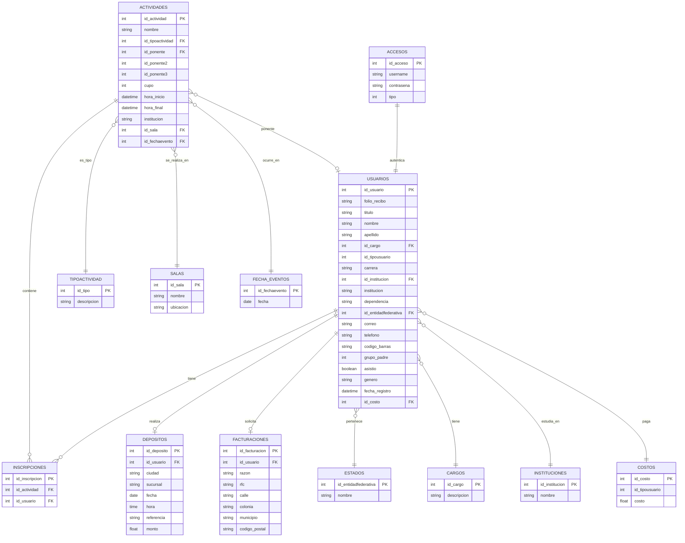
```mermaid
erDiagram
    USUARIOS ||--o{ INSCRIPCIONES : tiene
    USUARIOS ||--o| DEPOSITOS : realiza
    USUARIOS ||--o| FACTURACIONES : solicita
    USUARIOS }o--|| ESTADOS : pertenece
    USUARIOS }o--|| CARGOS : tiene
    USUARIOS }o--|| INSTITUCIONES : estudia_en
    USUARIOS }o--|| COSTOS : paga
    
    ACTIVIDADES ||--o{ INSCRIPCIONES : contiene
    ACTIVIDADES }o--|| TIPOACTIVIDAD : es_tipo
    ACTIVIDADES }o--|| SALAS : se_realiza_en
    ACTIVIDADES }o--|| FECHA_EVENTOS : ocurre_en
    ACTIVIDADES }o--o| USUARIOS : ponente
    
    ACCESOS ||--|| USUARIOS : autentica

    USUARIOS {
        int id_usuario PK
        string folio_recibo
        string titulo
        string nombre
        string apellido
        int id_cargo FK
        int id_tipousuario
        string carrera
        int id_institucion FK
        string institucion
        string dependencia
        int id_entidadfederativa FK
        string correo
        string telefono
        string codigo_barras
        int grupo_padre
        boolean asistio
        string genero
        datetime fecha_registro
        int id_costo FK
    }

    ACTIVIDADES {
        int id_actividad PK
        string nombre
        int id_tipoactividad FK
        int id_ponente FK
        int id_ponente2
        int id_ponente3
        int cupo
        datetime hora_inicio
        datetime hora_final
        string institucion
        int id_sala FK
        int id_fechaevento FK
    }

    INSCRIPCIONES {
        int id_inscripcion PK
        int id_actividad FK
        int id_usuario FK
    }

    DEPOSITOS {
        int id_deposito PK
        int id_usuario FK
        string ciudad
        string sucursal
        date fecha
        time hora
        string referencia
        float monto
    }

    FACTURACIONES {
        int id_facturacion PK
        int id_usuario FK
        string razon
        string rfc
        string calle
        string colonia
        string municipio
        string codigo_postal
    }

    ACCESOS {
        int id_acceso PK
        string username
        string contrasena
        int tipo
    }

    ESTADOS {
        int id_entidadfederativa PK
        string nombre
    }

    CARGOS {
        int id_cargo PK
        string descripcion
    }

    INSTITUCIONES {
        int id_institucion PK
        string nombre
    }

    COSTOS {
        int id_costo PK
        int id_tipousuario
        float costo
    }

    TIPOACTIVIDAD {
        int id_tipo PK
        string descripcion
    }

    SALAS {
        int id_sala PK
        string nombre
        string ubicacion
    }

    FECHA_EVENTOS {
        int id_fechaevento PK
        date fecha
    }
```

### Tablas Principales

| Tabla | Descripción |
|-------|-------------|
| `accesos` | Credenciales de acceso al sistema |
| `usuarios` | Participantes registrados (incluye grupos) |
| `actividades` | Talleres, conferencias, ponencias del congreso |
| `inscripciones` | Relación usuarios-actividades |
| `depositos` | Información de pagos/depósitos bancarios |
| `facturaciones` | Datos fiscales para facturación |
| `estados` | Catálogo de entidades federativas |
| `instituciones` | Catálogo de instituciones educativas |
| `cargos` | Catálogo de cargos (Alumno, Profesor, etc.) |
| `costos` | Precios según tipo de participante |
| `tipoactividad` | Tipos: Taller, Conferencia, Ponencia, etc. |
| `salas` | Ubicaciones físicas del evento |

---

## 🔄 Diagramas de Flujo

### Flujo de Registro de Participante

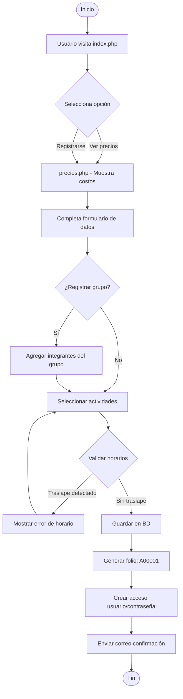
```mermaid
flowchart TD
    A([Inicio]) --> B[Usuario visita index.php]
    B --> C{Selecciona opción}
    C -->|Ver precios| D[precios.php - Muestra costos]
    C -->|Registrarse| D
    D --> E[Completa formulario de datos]
    E --> F{¿Registrar grupo?}
    F -->|Sí| G[Agregar integrantes del grupo]
    F -->|No| H[Seleccionar actividades]
    G --> H
    H --> I{Validar horarios}
    I -->|Traslape detectado| J[Mostrar error de horario]
    J --> H
    I -->|Sin traslape| K[Guardar en BD]
    K --> L[Generar folio: A00001]
    L --> M[Crear acceso usuario/contraseña]
    M --> N[Enviar correo confirmación]
    N --> O([Fin])
```

### Flujo de Administración

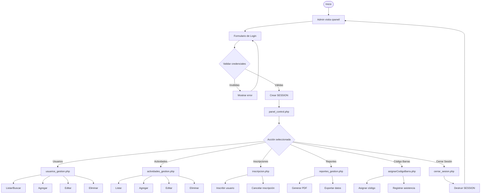
```mermaid
flowchart TD
    A([Inicio]) --> B[Admin visita cpanel/]
    B --> C[Formulario de Login]
    C --> D{Validar credenciales}
    D -->|Inválidas| E[Mostrar error]
    E --> C
    D -->|Válidas| F[Crear SESSION]
    F --> G[panel_control.php]
    
    G --> H{Acción seleccionada}
    
    H -->|Usuarios| I[usuarios_gestion.php]
    I --> I1[Listar/Buscar]
    I --> I2[Agregar]
    I --> I3[Editar]
    I --> I4[Eliminar]
    
    H -->|Actividades| J[actividades_gestion.php]
    J --> J1[Listar]
    J --> J2[Agregar]
    J --> J3[Editar]
    J --> J4[Eliminar]
    
    H -->|Inscripciones| K[inscripcion.php]
    K --> K1[Inscribir usuario]
    K --> K2[Cancelar inscripción]
    
    H -->|Reportes| L[reportes_gestion.php]
    L --> L1[Generar PDF]
    L --> L2[Exportar datos]
    
    H -->|Código Barras| M[asignarCodigoBarra.php]
    M --> M1[Asignar código]
    M --> M2[Registrar asistencia]
    
    H -->|Cerrar Sesión| N[cerrar_sesion.php]
    N --> O[Destruir SESSION]
    O --> B
```

---

## 📊 Diagramas de Secuencia

### Secuencia: Registro de Nuevo Participante

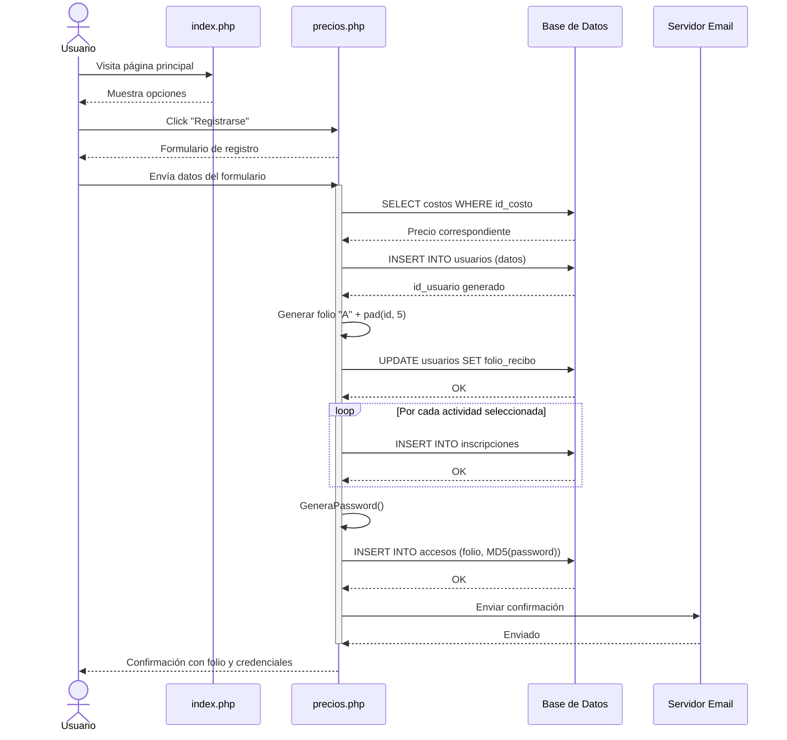
```mermaid
sequenceDiagram
    actor Usuario
    participant Index as index.php
    participant Precios as precios.php
    participant BD as Base de Datos
    participant Email as Servidor Email

    Usuario->>Index: Visita página principal
    Index-->>Usuario: Muestra opciones
    Usuario->>Precios: Click "Registrarse"
    Precios-->>Usuario: Formulario de registro
    
    Usuario->>Precios: Envía datos del formulario
    
    activate Precios
    Precios->>BD: SELECT costos WHERE id_costo
    BD-->>Precios: Precio correspondiente
    
    Precios->>BD: INSERT INTO usuarios (datos)
    BD-->>Precios: id_usuario generado
    
    Precios->>Precios: Generar folio "A" + pad(id, 5)
    
    Precios->>BD: UPDATE usuarios SET folio_recibo
    BD-->>Precios: OK
    
    loop Por cada actividad seleccionada
        Precios->>BD: INSERT INTO inscripciones
        BD-->>Precios: OK
    end
    
    Precios->>Precios: GeneraPassword()
    Precios->>BD: INSERT INTO accesos (folio, MD5(password))
    BD-->>Precios: OK
    
    Precios->>Email: Enviar confirmación
    Email-->>Precios: Enviado
    deactivate Precios
    
    Precios-->>Usuario: Confirmación con folio y credenciales
```

### Secuencia: Login de Administrador

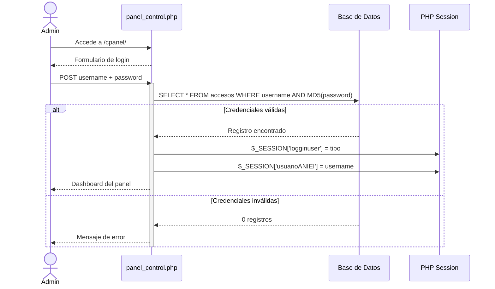
```mermaid
sequenceDiagram
    actor Admin
    participant Panel as panel_control.php
    participant BD as Base de Datos
    participant Session as PHP Session

    Admin->>Panel: Accede a /cpanel/
    Panel-->>Admin: Formulario de login
    
    Admin->>Panel: POST username + password
    
    activate Panel
    Panel->>BD: SELECT * FROM accesos WHERE username AND MD5(password)
    
    alt Credenciales válidas
        BD-->>Panel: Registro encontrado
        Panel->>Session: $_SESSION['logginuser'] = tipo
        Panel->>Session: $_SESSION['usuarioANIEI'] = username
        Panel-->>Admin: Dashboard del panel
    else Credenciales inválidas
        BD-->>Panel: 0 registros
        Panel-->>Admin: Mensaje de error
    end
    deactivate Panel
```

### Secuencia: Inscripción a Actividad

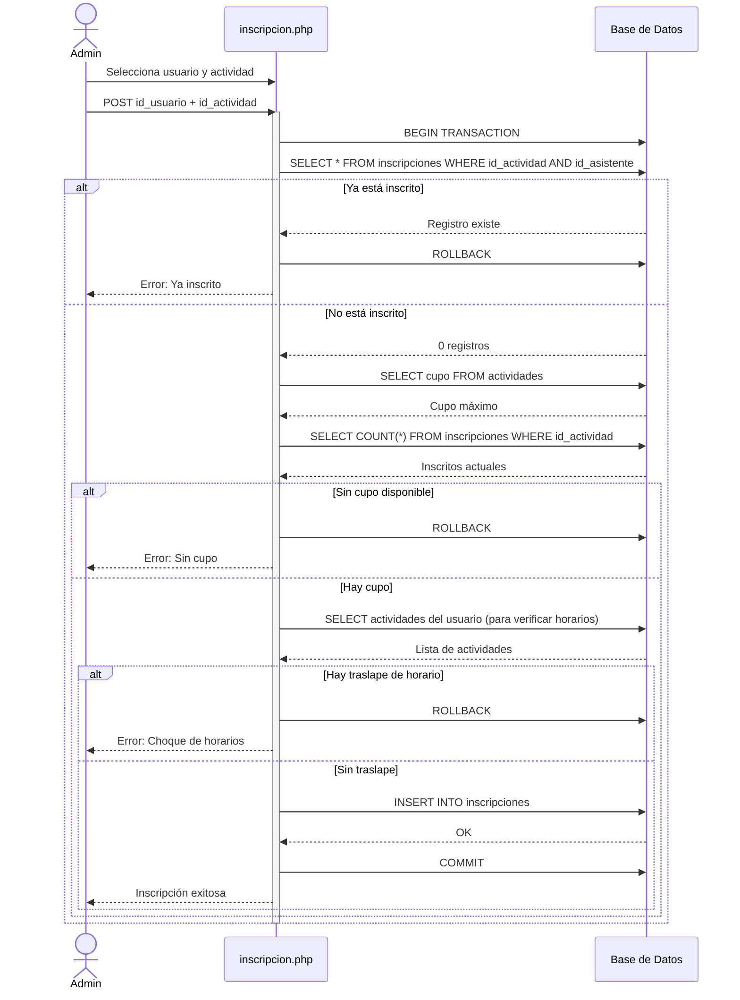
```mermaid
sequenceDiagram
    actor Admin
    participant Inscripcion as inscripcion.php
    participant BD as Base de Datos

    Admin->>Inscripcion: Selecciona usuario y actividad
    Admin->>Inscripcion: POST id_usuario + id_actividad
    
    activate Inscripcion
    Inscripcion->>BD: BEGIN TRANSACTION
    
    Inscripcion->>BD: SELECT * FROM inscripciones WHERE id_actividad AND id_asistente
    
    alt Ya está inscrito
        BD-->>Inscripcion: Registro existe
        Inscripcion->>BD: ROLLBACK
        Inscripcion-->>Admin: Error: Ya inscrito
    else No está inscrito
        BD-->>Inscripcion: 0 registros
        
        Inscripcion->>BD: SELECT cupo FROM actividades
        BD-->>Inscripcion: Cupo máximo
        
        Inscripcion->>BD: SELECT COUNT(*) FROM inscripciones WHERE id_actividad
        BD-->>Inscripcion: Inscritos actuales
        
        alt Sin cupo disponible
            Inscripcion->>BD: ROLLBACK
            Inscripcion-->>Admin: Error: Sin cupo
        else Hay cupo
            Inscripcion->>BD: SELECT actividades del usuario (para verificar horarios)
            BD-->>Inscripcion: Lista de actividades
            
            alt Hay traslape de horario
                Inscripcion->>BD: ROLLBACK
                Inscripcion-->>Admin: Error: Choque de horarios
            else Sin traslape
                Inscripcion->>BD: INSERT INTO inscripciones
                BD-->>Inscripcion: OK
                Inscripcion->>BD: COMMIT
                Inscripcion-->>Admin: Inscripción exitosa
            end
        end
    end
    deactivate Inscripcion
```

### Secuencia: Registro de Asistencia con Código de Barras

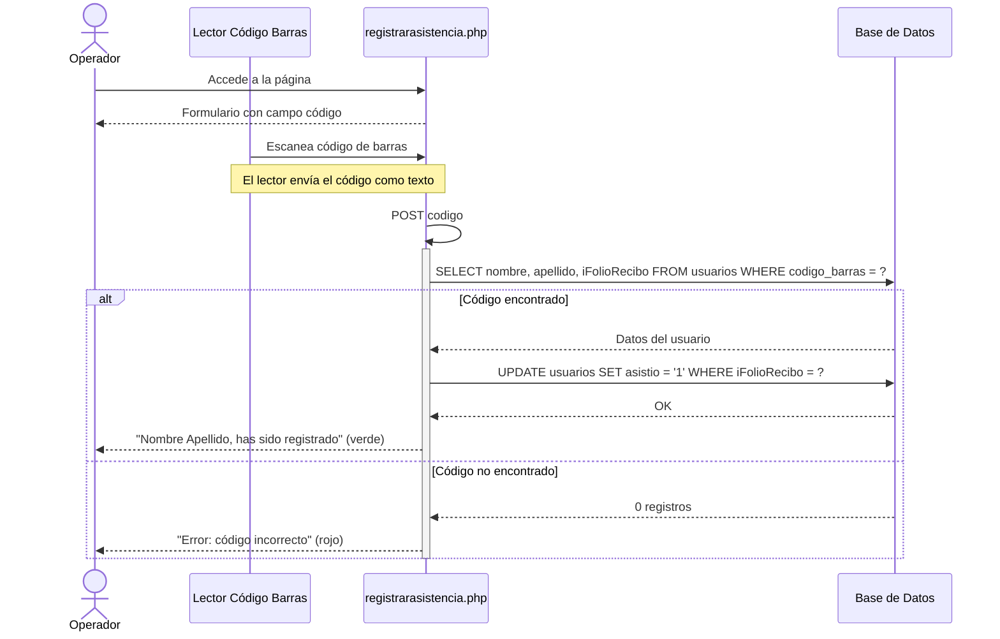
```mermaid
sequenceDiagram
    actor Operador
    participant Lector as Lector Código Barras
    participant Asistencia as registrarasistencia.php
    participant BD as Base de Datos

    Operador->>Asistencia: Accede a la página
    Asistencia-->>Operador: Formulario con campo código
    
    Lector->>Asistencia: Escanea código de barras
    Note over Lector,Asistencia: El lector envía el código como texto
    
    Asistencia->>Asistencia: POST codigo
    
    activate Asistencia
    Asistencia->>BD: SELECT nombre, apellido, iFolioRecibo FROM usuarios WHERE codigo_barras = ?
    
    alt Código encontrado
        BD-->>Asistencia: Datos del usuario
        Asistencia->>BD: UPDATE usuarios SET asistio = '1' WHERE iFolioRecibo = ?
        BD-->>Asistencia: OK
        Asistencia-->>Operador: "Nombre Apellido, has sido registrado" (verde)
    else Código no encontrado
        BD-->>Asistencia: 0 registros
        Asistencia-->>Operador: "Error: código incorrecto" (rojo)
    end
    deactivate Asistencia
```

### Secuencia: Generación de Reporte PDF

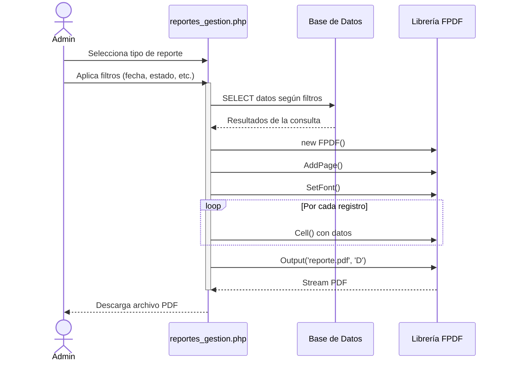
```mermaid
sequenceDiagram
    actor Admin
    participant Reportes as reportes_gestion.php
    participant BD as Base de Datos
    participant FPDF as Librería FPDF

    Admin->>Reportes: Selecciona tipo de reporte
    Admin->>Reportes: Aplica filtros (fecha, estado, etc.)
    
    activate Reportes
    Reportes->>BD: SELECT datos según filtros
    BD-->>Reportes: Resultados de la consulta
    
    Reportes->>FPDF: new FPDF()
    Reportes->>FPDF: AddPage()
    Reportes->>FPDF: SetFont()
    
    loop Por cada registro
        Reportes->>FPDF: Cell() con datos
    end
    
    Reportes->>FPDF: Output('reporte.pdf', 'D')
    FPDF-->>Reportes: Stream PDF
    deactivate Reportes
    
    Reportes-->>Admin: Descarga archivo PDF
```

### Secuencia: CRUD de Usuarios (Eliminar)

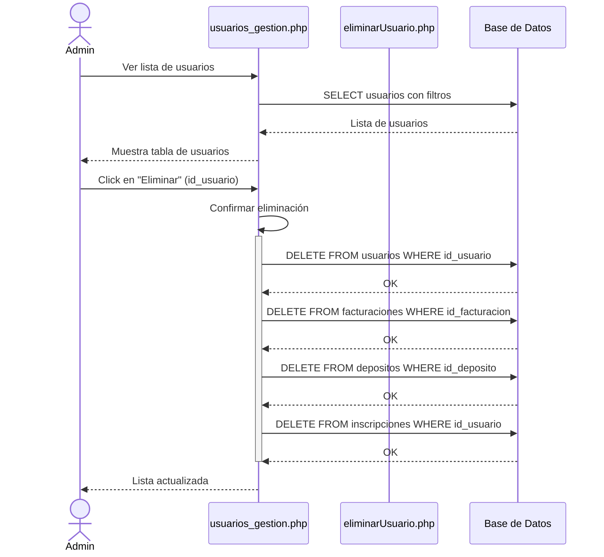
```mermaid
sequenceDiagram
    actor Admin
    participant Lista as usuarios_gestion.php
    participant Eliminar as eliminarUsuario.php
    participant BD as Base de Datos

    Admin->>Lista: Ver lista de usuarios
    Lista->>BD: SELECT usuarios con filtros
    BD-->>Lista: Lista de usuarios
    Lista-->>Admin: Muestra tabla de usuarios
    
    Admin->>Lista: Click en "Eliminar" (id_usuario)
    Lista->>Lista: Confirmar eliminación
    
    activate Lista
    Lista->>BD: DELETE FROM usuarios WHERE id_usuario
    BD-->>Lista: OK
    
    Lista->>BD: DELETE FROM facturaciones WHERE id_facturacion
    BD-->>Lista: OK
    
    Lista->>BD: DELETE FROM depositos WHERE id_deposito
    BD-->>Lista: OK
    
    Lista->>BD: DELETE FROM inscripciones WHERE id_usuario
    BD-->>Lista: OK
    deactivate Lista
    
    Lista-->>Admin: Lista actualizada
```

---

## 👤 Tipos de Usuario

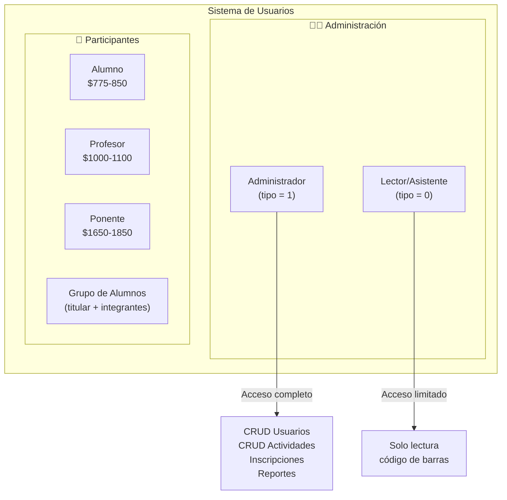
```mermaid
flowchart TB
    subgraph Sistema["Sistema de Usuarios"]
        subgraph Admins["👨‍💼 Administración"]
            ADMIN["Administrador<br/>(tipo = 1)"]
            LECTOR["Lector/Asistente<br/>(tipo = 0)"]
        end
        
        subgraph Participantes["👥 Participantes"]
            ALUMNO["Alumno<br/>$775-850"]
            PROFESOR["Profesor<br/>$1000-1100"]
            PONENTE["Ponente<br/>$1650-1850"]
            GRUPO["Grupo de Alumnos<br/>(titular + integrantes)"]
        end
    end
    
    ADMIN -->|Acceso completo| CRUD["CRUD Usuarios<br/>CRUD Actividades<br/>Inscripciones<br/>Reportes"]
    LECTOR -->|Acceso limitado| BARRAS["Solo lectura<br/>código de barras"]
```

### Permisos por Tipo

| Tipo | Panel | Usuarios | Actividades | Inscripciones | Reportes | Código Barras |
|------|-------|----------|-------------|---------------|----------|---------------|
| Admin (1) | ✅ | ✅ CRUD | ✅ CRUD | ✅ | ✅ | ✅ |
| Lector (0) | ✅ | ❌ | ❌ | ❌ | ❌ | ✅ |

---

## 🎯 Tipos de Actividades

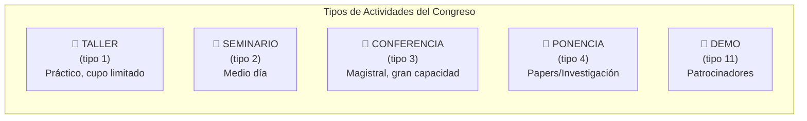
```mermaid
flowchart LR
    subgraph Actividades["Tipos de Actividades del Congreso"]
        T1["🔧 TALLER<br/>(tipo 1)<br/>Práctico, cupo limitado"]
        T2["📖 SEMINARIO<br/>(tipo 2)<br/>Medio día"]
        T3["🎤 CONFERENCIA<br/>(tipo 3)<br/>Magistral, gran capacidad"]
        T4["📄 PONENCIA<br/>(tipo 4)<br/>Papers/Investigación"]
        T5["💼 DEMO<br/>(tipo 11)<br/>Patrocinadores"]
    end
```

---

## 🔐 Flujo de Autenticación

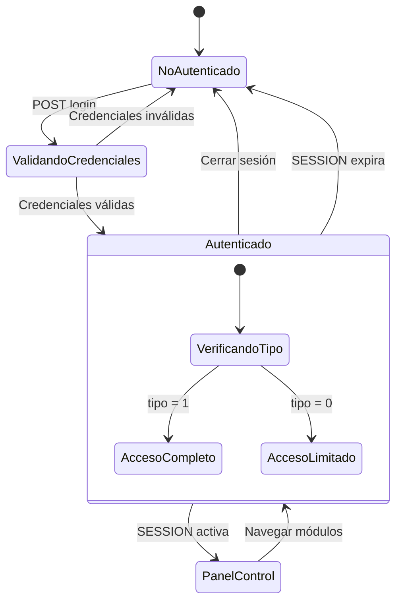
```mermaid
stateDiagram-v2
    [*] --> NoAutenticado
    
    NoAutenticado --> ValidandoCredenciales: POST login
    ValidandoCredenciales --> Autenticado: Credenciales válidas
    ValidandoCredenciales --> NoAutenticado: Credenciales inválidas
    
    Autenticado --> PanelControl: SESSION activa
    PanelControl --> Autenticado: Navegar módulos
    
    Autenticado --> NoAutenticado: Cerrar sesión
    Autenticado --> NoAutenticado: SESSION expira
    
    state Autenticado {
        [*] --> VerificandoTipo
        VerificandoTipo --> AccesoCompleto: tipo = 1
        VerificandoTipo --> AccesoLimitado: tipo = 0
    }
```

---

## 🛠️ Tecnologías Utilizadas

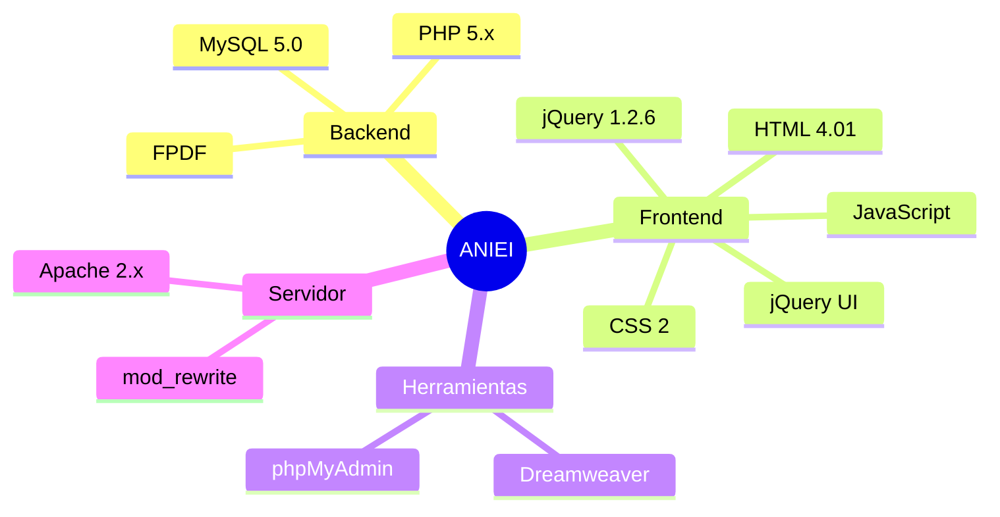
```mermaid
mindmap
  root((ANIEI))
    Backend
      PHP 5.x
      MySQL 5.0
      FPDF
    Frontend
      HTML 4.01
      CSS 2
      JavaScript
      jQuery 1.2.6
      jQuery UI
    Herramientas
      Dreamweaver
      phpMyAdmin
    Servidor
      Apache 2.x
      mod_rewrite
```

| Categoría | Tecnología | Versión |
|-----------|------------|---------|
| **Backend** | PHP | ~5.x |
| **Base de Datos** | MySQL | ~5.0 |
| **Frontend** | HTML 4.01 | - |
| **Estilos** | CSS 2 | - |
| **JavaScript** | jQuery | 1.2.6 |
| **UI Components** | jQuery UI | - |
| **PDF Generator** | FPDF | - |
| **IDE** | Dreamweaver | (Templates .dwt) |

---

## ⚠️ Notas de Seguridad

> **IMPORTANTE:** Este sistema fue desarrollado aproximadamente en 2007-2008 y contiene prácticas de seguridad obsoletas:

1. **SQL Injection**: Las consultas SQL no utilizan prepared statements
2. **Funciones obsoletas**: Usa `mysql_*` (deprecadas desde PHP 5.5)
3. **Contraseñas**: Usa MD5 simple (inseguro)
4. **XSS**: No hay sanitización completa de entradas

### Recomendaciones de Modernización

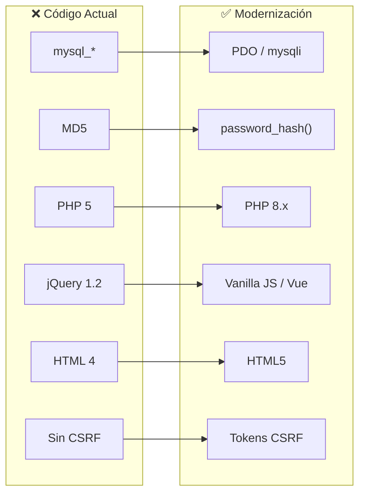
```mermaid
flowchart LR
    subgraph Actual["❌ Código Actual"]
        A1["mysql_*"]
        A2["MD5"]
        A3["PHP 5"]
        A4["jQuery 1.2"]
        A5["HTML 4"]
        A6["Sin CSRF"]
    end
    
    subgraph Moderno["✅ Modernización"]
        B1["PDO / mysqli"]
        B2["password_hash()"]
        B3["PHP 8.x"]
        B4["Vanilla JS / Vue"]
        B5["HTML5"]
        B6["Tokens CSRF"]
    end
    
    A1 --> B1
    A2 --> B2
    A3 --> B3
    A4 --> B4
    A5 --> B5
    A6 --> B6
```

---

## 📁 Mapa de Navegación del Sistema

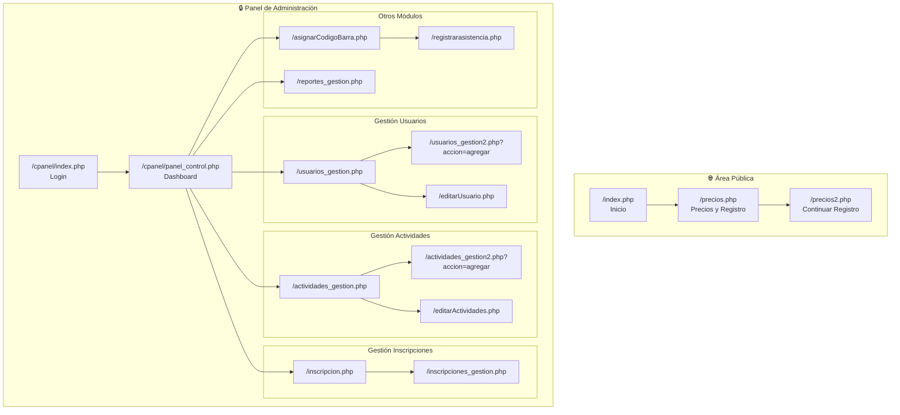
```mermaid
flowchart TB
    subgraph Publico["🌐 Área Pública"]
        HOME["/index.php<br/>Inicio"]
        PRECIOS["/precios.php<br/>Precios y Registro"]
        PRECIOS2["/precios2.php<br/>Continuar Registro"]
    end
    
    subgraph Admin["🔒 Panel de Administración"]
        LOGIN["/cpanel/index.php<br/>Login"]
        PANEL["/cpanel/panel_control.php<br/>Dashboard"]
        
        subgraph Usuarios["Gestión Usuarios"]
            U_LIST["/usuarios_gestion.php"]
            U_ADD["/usuarios_gestion2.php?accion=agregar"]
            U_EDIT["/editarUsuario.php"]
        end
        
        subgraph Actividades["Gestión Actividades"]
            A_LIST["/actividades_gestion.php"]
            A_ADD["/actividades_gestion2.php?accion=agregar"]
            A_EDIT["/editarActividades.php"]
        end
        
        subgraph Inscripciones["Gestión Inscripciones"]
            I_NEW["/inscripcion.php"]
            I_LIST["/inscripciones_gestion.php"]
        end
        
        subgraph Otros["Otros Módulos"]
            BARRAS["/asignarCodigoBarra.php"]
            REPORTES["/reportes_gestion.php"]
            ASIST["/registrarasistencia.php"]
        end
    end
    
    HOME --> PRECIOS
    PRECIOS --> PRECIOS2
    
    LOGIN --> PANEL
    PANEL --> U_LIST & A_LIST & I_NEW & BARRAS & REPORTES
    U_LIST --> U_ADD & U_EDIT
    A_LIST --> A_ADD & A_EDIT
    I_NEW --> I_LIST
    BARRAS --> ASIST
```

---

## 🔄 Diagrama de Componentes

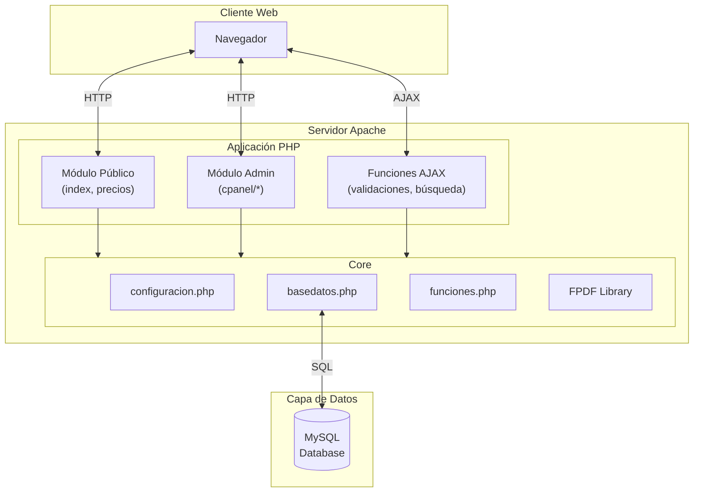
```mermaid
flowchart TB
    subgraph Cliente["Cliente Web"]
        Browser["Navegador"]
    end
    
    subgraph Servidor["Servidor Apache"]
        subgraph App["Aplicación PHP"]
            Public["Módulo Público<br/>(index, precios)"]
            Admin["Módulo Admin<br/>(cpanel/*)"]
            API["Funciones AJAX<br/>(validaciones, búsqueda)"]
        end
        
        subgraph Core["Core"]
            Config["configuracion.php"]
            DBLayer["basedatos.php"]
            Utils["funciones.php"]
            PDFGen["FPDF Library"]
        end
    end
    
    subgraph Data["Capa de Datos"]
        MySQL[(MySQL<br/>Database)]
    end
    
    Browser <-->|HTTP| Public
    Browser <-->|HTTP| Admin
    Browser <-->|AJAX| API
    
    Public --> Core
    Admin --> Core
    API --> Core
    
    DBLayer <-->|SQL| MySQL
```

---

## 📊 Estadísticas del Proyecto

| Métrica | Valor |
|---------|-------|
| Archivos PHP | ~50 |
| Tablas en BD | ~15 |
| Líneas de código | ~10,000+ |
| Año de desarrollo | 2007-2008 |

---

*Documentación generada el 2 de febrero de 2026*
