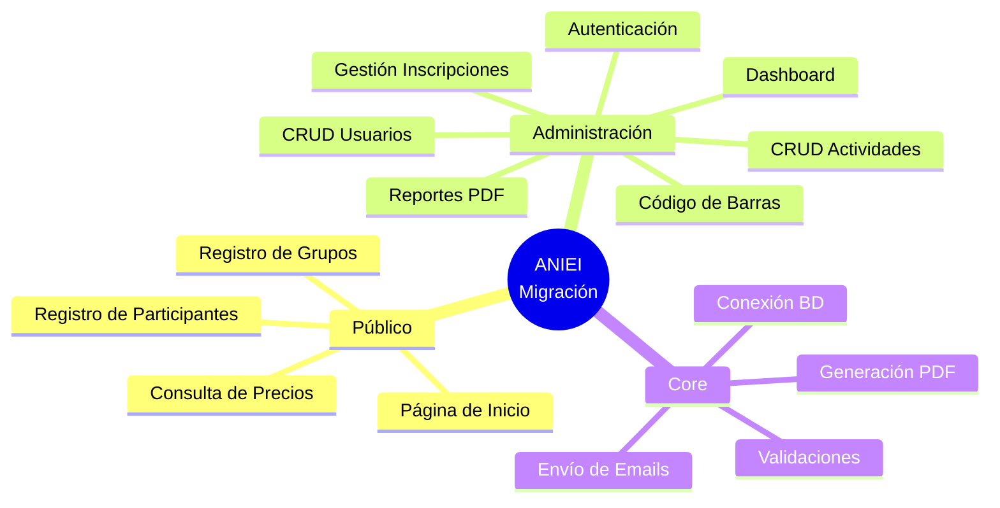
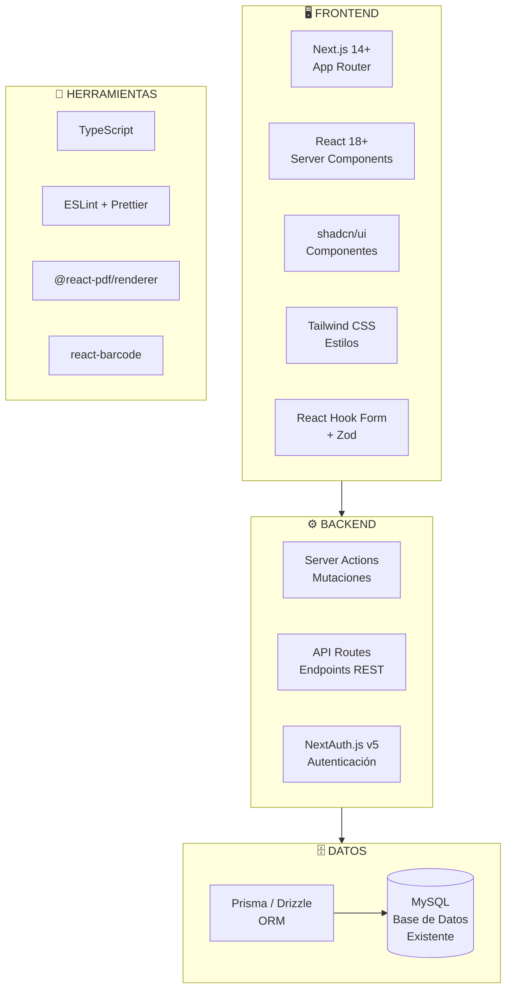
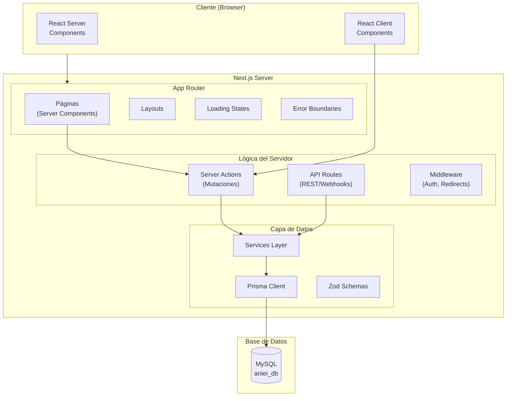
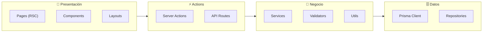
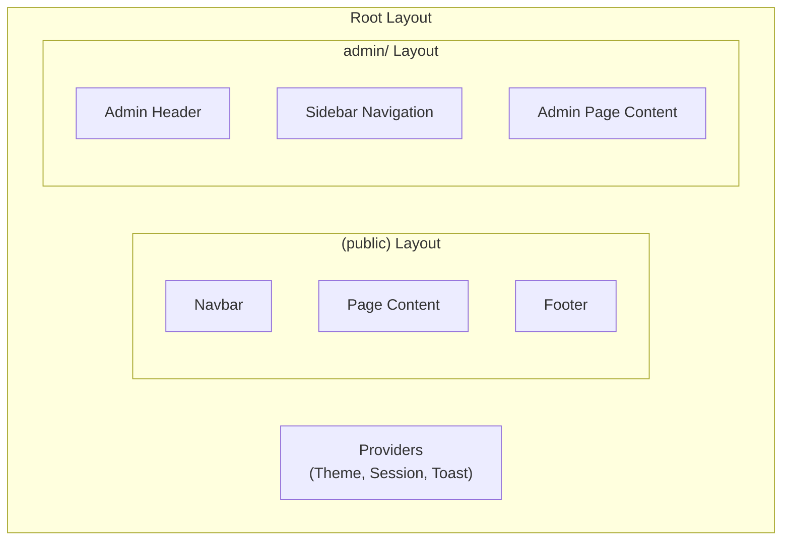
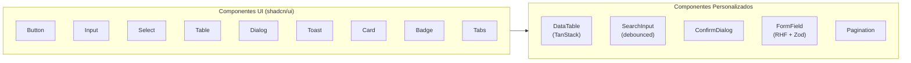
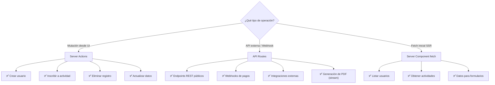
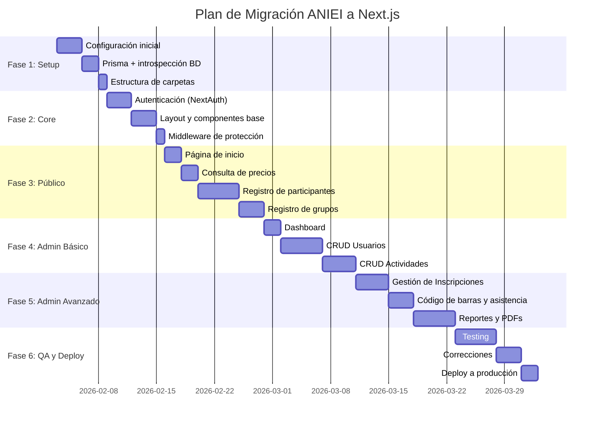
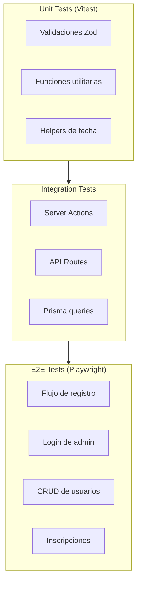

# 🚀 Plan de Migración ANIEI a Next.js

## Resumen Ejecutivo

Este documento detalla el plan de migración del sistema ANIEI desde su stack actual (PHP 5.x + MySQL + jQuery) hacia un stack moderno basado en **Next.js 14+** con **App Router**, aprovechando las capacidades de Server Components y Server Actions para unificar la lógica de frontend y backend en una sola tecnología.

---

## 📋 Tabla de Contenidos

1. [Análisis del Sistema Actual](#-análisis-del-sistema-actual)
2. [Stack Tecnológico Propuesto](#-stack-tecnológico-propuesto)
3. [Arquitectura del Nuevo Sistema](#-arquitectura-del-nuevo-sistema)
4. [Estructura de Carpetas](#-estructura-de-carpetas)
5. [Modelo de Datos](#-modelo-de-datos)
6. [Diseño de Componentes](#-diseño-de-componentes)
7. [Server Actions vs API Routes](#-server-actions-vs-api-routes)
8. [Plan de Migración por Fases](#-plan-de-migración-por-fases)
9. [Autenticación y Seguridad](#-autenticación-y-seguridad)
10. [Testing y QA](#-testing-y-qa)

---

## 📊 Análisis del Sistema Actual

### Módulos a Migrar



### Mapeo de Funcionalidades

| Módulo Actual (PHP) | Nuevo Módulo (Next.js) | Prioridad |
|---------------------|------------------------|-----------|
| `index.php` | `/app/page.tsx` | Alta |
| `precios.php` | `/app/registro/page.tsx` | Alta |
| `cpanel/panel_control.php` | `/app/admin/page.tsx` | Alta |
| `cpanel/usuarios_gestion.php` | `/app/admin/usuarios/page.tsx` | Alta |
| `cpanel/actividades_gestion.php` | `/app/admin/actividades/page.tsx` | Alta |
| `cpanel/inscripcion.php` | `/app/admin/inscripciones/page.tsx` | Alta |
| `cpanel/reportes_gestion.php` | `/app/admin/reportes/page.tsx` | Media |
| `cpanel/asignarCodigoBarra.php` | `/app/admin/asistencia/page.tsx` | Media |
| `funciones/basedatos.php` | `/lib/db.ts` (Prisma/Drizzle) | Alta |
| `funciones/funciones.php` | `/lib/utils.ts` | Alta |

---

## 🛠️ Stack Tecnológico Propuesto



### Tecnologías Seleccionadas

| Categoría | Tecnología | Justificación |
|-----------|------------|---------------|
| **Framework** | Next.js 14+ | App Router, Server Components, Server Actions |
| **Lenguaje** | TypeScript | Tipado estático, mejor DX |
| **Estilos** | Tailwind CSS | Utility-first, rápido desarrollo |
| **Componentes UI** | shadcn/ui | Componentes accesibles, personalizables |
| **ORM** | Prisma | Type-safe, migraciones, introspección BD existente |
| **Autenticación** | NextAuth.js v5 | Integración nativa con Next.js |
| **Validación** | Zod | Schemas de validación, inferencia de tipos |
| **Formularios** | React Hook Form | Performance, validación integrada |
| **PDF** | @react-pdf/renderer | Generación de PDFs en React |
| **Tablas** | TanStack Table | Tablas con sorting, filtrado, paginación |
| **Estado** | Zustand (opcional) | Estado global ligero si es necesario |

---

## 🏗️ Arquitectura del Nuevo Sistema

### Diagrama de Arquitectura



### Patrón de Capas



---

## 📁 Estructura de Carpetas

```
aniei-next/
├── app/                          # App Router (Next.js 14)
│   ├── (auth)/                   # Grupo de rutas - Autenticación
│   │   ├── login/
│   │   │   └── page.tsx
│   │   └── layout.tsx
│   │
│   ├── (public)/                 # Grupo de rutas - Área pública
│   │   ├── page.tsx              # Página de inicio
│   │   ├── registro/
│   │   │   ├── page.tsx          # Formulario de registro
│   │   │   ├── precios/
│   │   │   │   └── page.tsx      # Consulta de precios
│   │   │   ├── confirmacion/
│   │   │   │   └── page.tsx      # Confirmación de registro
│   │   │   └── _components/      # Componentes específicos
│   │   │       ├── FormularioRegistro.tsx
│   │   │       ├── SelectorActividades.tsx
│   │   │       └── FormularioGrupo.tsx
│   │   └── layout.tsx
│   │
│   ├── admin/                    # Área de administración
│   │   ├── page.tsx              # Dashboard
│   │   ├── layout.tsx            # Layout con sidebar
│   │   │
│   │   ├── usuarios/
│   │   │   ├── page.tsx          # Lista de usuarios
│   │   │   ├── nuevo/
│   │   │   │   └── page.tsx      # Crear usuario
│   │   │   ├── [id]/
│   │   │   │   ├── page.tsx      # Ver usuario
│   │   │   │   └── editar/
│   │   │   │       └── page.tsx  # Editar usuario
│   │   │   └── _components/
│   │   │       ├── TablaUsuarios.tsx
│   │   │       ├── FormularioUsuario.tsx
│   │   │       └── FiltrosUsuarios.tsx
│   │   │
│   │   ├── actividades/
│   │   │   ├── page.tsx          # Lista de actividades
│   │   │   ├── nueva/
│   │   │   │   └── page.tsx
│   │   │   ├── [id]/
│   │   │   │   ├── page.tsx
│   │   │   │   ├── editar/
│   │   │   │   │   └── page.tsx
│   │   │   │   └── inscritos/
│   │   │   │       └── page.tsx  # Ver inscritos
│   │   │   └── _components/
│   │   │       ├── TablaActividades.tsx
│   │   │       └── FormularioActividad.tsx
│   │   │
│   │   ├── inscripciones/
│   │   │   ├── page.tsx          # Gestión de inscripciones
│   │   │   ├── nueva/
│   │   │   │   └── page.tsx      # Nueva inscripción
│   │   │   └── _components/
│   │   │       ├── BuscadorUsuario.tsx
│   │   │       └── SelectorActividad.tsx
│   │   │
│   │   ├── asistencia/
│   │   │   ├── page.tsx          # Registro de asistencia
│   │   │   ├── codigo-barras/
│   │   │   │   └── page.tsx      # Asignar códigos
│   │   │   └── _components/
│   │   │       ├── LectorCodigo.tsx
│   │   │       └── ResultadoEscaneo.tsx
│   │   │
│   │   └── reportes/
│   │       ├── page.tsx          # Centro de reportes
│   │       ├── usuarios/
│   │       │   └── page.tsx
│   │       ├── actividades/
│   │       │   └── page.tsx
│   │       └── _components/
│   │           ├── FiltrosReporte.tsx
│   │           └── PreviewPDF.tsx
│   │
│   ├── api/                      # API Routes
│   │   ├── auth/
│   │   │   └── [...nextauth]/
│   │   │       └── route.ts      # NextAuth handler
│   │   ├── usuarios/
│   │   │   ├── route.ts          # GET all, POST create
│   │   │   └── [id]/
│   │   │       └── route.ts      # GET, PUT, DELETE by id
│   │   ├── actividades/
│   │   │   └── route.ts
│   │   ├── inscripciones/
│   │   │   └── route.ts
│   │   ├── reportes/
│   │   │   └── pdf/
│   │   │       └── route.ts      # Generación de PDF
│   │   └── webhooks/
│   │       └── route.ts          # Webhooks externos
│   │
│   ├── globals.css               # Estilos globales (Tailwind)
│   ├── layout.tsx                # Root layout
│   ├── loading.tsx               # Loading global
│   ├── error.tsx                 # Error boundary global
│   └── not-found.tsx             # 404 page
│
├── components/                   # Componentes compartidos
│   ├── ui/                       # shadcn/ui components
│   │   ├── button.tsx
│   │   ├── input.tsx
│   │   ├── select.tsx
│   │   ├── table.tsx
│   │   ├── dialog.tsx
│   │   ├── toast.tsx
│   │   └── ...
│   │
│   ├── layout/                   # Componentes de layout
│   │   ├── Header.tsx
│   │   ├── Sidebar.tsx
│   │   ├── Footer.tsx
│   │   └── Navbar.tsx
│   │
│   ├── forms/                    # Componentes de formularios
│   │   ├── FormField.tsx
│   │   ├── SelectEstado.tsx
│   │   ├── SelectInstitucion.tsx
│   │   └── SelectCargo.tsx
│   │
│   └── shared/                   # Componentes compartidos
│       ├── DataTable.tsx
│       ├── Pagination.tsx
│       ├── SearchInput.tsx
│       ├── ConfirmDialog.tsx
│       ├── LoadingSpinner.tsx
│       └── EmptyState.tsx
│
├── lib/                          # Utilidades y configuraciones
│   ├── db.ts                     # Prisma client instance
│   ├── auth.ts                   # NextAuth configuration
│   ├── utils.ts                  # Funciones utilitarias
│   ├── constants.ts              # Constantes de la aplicación
│   └── validations/              # Schemas de Zod
│       ├── usuario.ts
│       ├── actividad.ts
│       ├── inscripcion.ts
│       └── auth.ts
│
├── actions/                      # Server Actions
│   ├── usuarios.ts               # Actions de usuarios
│   ├── actividades.ts            # Actions de actividades
│   ├── inscripciones.ts          # Actions de inscripciones
│   ├── asistencia.ts             # Actions de asistencia
│   └── reportes.ts               # Actions de reportes
│
├── services/                     # Capa de servicios (lógica de negocio)
│   ├── usuario.service.ts
│   ├── actividad.service.ts
│   ├── inscripcion.service.ts
│   ├── asistencia.service.ts
│   ├── reporte.service.ts
│   └── email.service.ts
│
├── types/                        # Tipos TypeScript
│   ├── index.ts                  # Re-exports
│   ├── usuario.ts
│   ├── actividad.ts
│   ├── inscripcion.ts
│   └── api.ts                    # Tipos para API responses
│
├── hooks/                        # Custom React hooks
│   ├── useUsuarios.ts
│   ├── useActividades.ts
│   ├── usePagination.ts
│   └── useDebounce.ts
│
├── prisma/                       # Prisma ORM
│   ├── schema.prisma             # Schema de la BD
│   ├── migrations/               # Migraciones
│   └── seed.ts                   # Datos iniciales
│
├── public/                       # Archivos estáticos
│   ├── images/
│   │   └── logo.png
│   └── fonts/
│
├── middleware.ts                 # Next.js middleware (auth protection)
├── next.config.js                # Configuración de Next.js
├── tailwind.config.ts            # Configuración de Tailwind
├── tsconfig.json                 # Configuración TypeScript
├── .env                          # Variables de entorno
├── .env.example                  # Ejemplo de variables
└── package.json
```

---

## 🗄️ Modelo de Datos

### Introspección de BD Existente

Utilizaremos Prisma para introspeccionar la base de datos MySQL existente y generar el schema automáticamente:

```bash
npx prisma db pull
```

### Schema Prisma Propuesto

```prisma
// prisma/schema.prisma

generator client {
  provider = "prisma-client-js"
}

datasource db {
  provider = "mysql"
  url      = env("DATABASE_URL")
}

model Usuario {
  id                Int            @id @default(autoincrement()) @map("id_usuario")
  folioRecibo       String?        @map("folio_recibo") @db.VarChar(10)
  titulo            String?        @db.VarChar(10)
  nombre            String         @db.VarChar(50)
  apellido          String         @db.VarChar(50)
  cargoId           Int?           @map("id_cargo")
  tipoUsuarioId     Int?           @map("id_tipousuario")
  carrera           String?        @db.VarChar(100)
  institucionId     Int?           @map("id_institucion")
  institucion       String?        @db.VarChar(100)
  dependencia       String?        @db.VarChar(100)
  estadoId          Int?           @map("id_entidadfederativa")
  correo            String?        @db.VarChar(100)
  lada              String?        @db.VarChar(5)
  telefono          String?        @db.VarChar(15)
  extension         String?        @db.VarChar(10)
  codigoBarras      String?        @map("codigo_barras") @db.VarChar(50)
  grupoPadre        Int?           @map("grupo_padre")
  asistio           Boolean        @default(false)
  genero            String?        @db.VarChar(1)
  fechaRegistro     DateTime?      @default(now()) @map("fecha_registro")
  costoId           Int?           @map("id_costo")
  
  // Relaciones
  cargo             Cargo?         @relation(fields: [cargoId], references: [id])
  estado            Estado?        @relation(fields: [estadoId], references: [id])
  institucionRef    Institucion?   @relation(fields: [institucionId], references: [id])
  costo             Costo?         @relation(fields: [costoId], references: [id])
  deposito          Deposito?
  facturacion       Facturacion?
  inscripciones     Inscripcion[]
  acceso            Acceso?
  
  // Auto-relación para grupos
  padre             Usuario?       @relation("GrupoIntegrantes", fields: [grupoPadre], references: [id])
  integrantes       Usuario[]      @relation("GrupoIntegrantes")
  
  // Actividades como ponente
  actividadesPonente Actividad[]   @relation("Ponente")

  @@map("usuarios")
}

model Actividad {
  id              Int           @id @default(autoincrement()) @map("id_actividad")
  nombre          String        @db.VarChar(200)
  tipoActividadId Int?          @map("id_tipoactividad")
  ponenteId       Int?          @map("id_ponente")
  ponente2Id      Int?          @map("id_ponente2")
  ponente3Id      Int?          @map("id_ponente3")
  cupo            Int           @default(0)
  horaInicio      DateTime      @map("hora_inicio")
  horaFinal       DateTime      @map("hora_final")
  institucion     String?       @db.VarChar(100)
  salaId          Int?          @map("id_sala")
  fechaEventoId   Int?          @map("id_fechaevento")
  
  // Relaciones
  tipoActividad   TipoActividad? @relation(fields: [tipoActividadId], references: [id])
  ponente         Usuario?       @relation("Ponente", fields: [ponenteId], references: [id])
  sala            Sala?          @relation(fields: [salaId], references: [id])
  fechaEvento     FechaEvento?   @relation(fields: [fechaEventoId], references: [id])
  inscripciones   Inscripcion[]

  @@map("actividades")
}

model Inscripcion {
  id           Int       @id @default(autoincrement()) @map("id_inscripcion")
  actividadId  Int       @map("id_actividad")
  usuarioId    Int       @map("id_usuario")
  
  actividad    Actividad @relation(fields: [actividadId], references: [id], onDelete: Cascade)
  usuario      Usuario   @relation(fields: [usuarioId], references: [id], onDelete: Cascade)

  @@unique([actividadId, usuarioId])
  @@map("inscripciones")
}

model Acceso {
  id         Int     @id @default(autoincrement()) @map("id_acceso")
  username   String  @unique @db.VarChar(30)
  contrasena String  @db.VarChar(255) // Cambiar a bcrypt hash
  tipo       Int     @default(0) // 0 = lector, 1 = admin
  usuarioId  Int?    @unique @map("id_usuario")
  
  usuario    Usuario? @relation(fields: [usuarioId], references: [id])

  @@map("accesos")
}

model Deposito {
  id         Int      @id @default(autoincrement()) @map("id_deposito")
  usuarioId  Int      @unique @map("id_usuario")
  ciudad     String?  @db.VarChar(30)
  sucursal   String?  @db.VarChar(30)
  fecha      DateTime @db.Date
  hora       DateTime @db.Time(0)
  referencia String?  @db.VarChar(10)
  monto      Float    @default(0)
  
  usuario    Usuario  @relation(fields: [usuarioId], references: [id], onDelete: Cascade)

  @@map("depositos")
}

model Facturacion {
  id           Int      @id @default(autoincrement()) @map("id_facturacion")
  usuarioId    Int      @unique @map("id_usuario")
  razon        String?  @db.VarChar(100)
  rfc          String?  @db.VarChar(30)
  calle        String?  @db.VarChar(100)
  exterior     String?  @db.VarChar(10)
  interior     String?  @db.VarChar(10)
  colonia      String?  @db.VarChar(50)
  municipio    String?  @db.VarChar(50)
  estadoRfcId  Int?     @map("id_entidadfederativaRFC")
  codigoPostal String?  @map("codigo_postal") @db.VarChar(10)
  
  usuario      Usuario  @relation(fields: [usuarioId], references: [id], onDelete: Cascade)

  @@map("facturaciones")
}

// Catálogos
model Estado {
  id       Int       @id @default(autoincrement()) @map("id_entidadfederativa")
  nombre   String    @db.VarChar(50)
  usuarios Usuario[]

  @@map("estados")
}

model Cargo {
  id          Int       @id @default(autoincrement()) @map("id_cargo")
  descripcion String    @db.VarChar(50)
  usuarios    Usuario[]

  @@map("cargos")
}

model Institucion {
  id       Int       @id @default(autoincrement()) @map("id_institucion")
  nombre   String    @db.VarChar(150)
  usuarios Usuario[]

  @@map("instituciones")
}

model Costo {
  id            Int       @id @default(autoincrement()) @map("id_costo")
  tipoUsuarioId Int       @map("id_tipousuario")
  costo         Float     @default(0)
  usuarios      Usuario[]

  @@map("costos")
}

model TipoActividad {
  id          Int         @id @default(autoincrement()) @map("id_tipo")
  descripcion String      @db.VarChar(50)
  actividades Actividad[]

  @@map("tipoactividad")
}

model Sala {
  id          Int         @id @default(autoincrement()) @map("id_sala")
  nombre      String      @db.VarChar(50)
  ubicacion   String?     @db.VarChar(100)
  actividades Actividad[]

  @@map("salas")
}

model FechaEvento {
  id          Int         @id @default(autoincrement()) @map("id_fechaevento")
  fecha       DateTime    @db.Date
  actividades Actividad[]

  @@map("fecha_eventos")
}
```

---

## 🧩 Diseño de Componentes

### Árbol de Componentes Principal



### Componentes de UI Compartidos



### Componente DataTable (Ejemplo)

```tsx
// components/shared/DataTable.tsx
"use client"

import {
  ColumnDef,
  flexRender,
  getCoreRowModel,
  useReactTable,
  getPaginationRowModel,
  getSortedRowModel,
  getFilteredRowModel,
} from "@tanstack/react-table"

interface DataTableProps<TData, TValue> {
  columns: ColumnDef<TData, TValue>[]
  data: TData[]
  searchKey?: string
  pagination?: boolean
}

export function DataTable<TData, TValue>({
  columns,
  data,
  searchKey,
  pagination = true,
}: DataTableProps<TData, TValue>) {
  // Implementación con TanStack Table
}
```

---

## ⚡ Server Actions vs API Routes

### Cuándo usar cada uno



### Ejemplos de Server Actions

```typescript
// actions/usuarios.ts
"use server"

import { revalidatePath } from "next/cache"
import { redirect } from "next/navigation"
import { z } from "zod"
import { prisma } from "@/lib/db"
import { usuarioSchema } from "@/lib/validations/usuario"

// Crear usuario
export async function crearUsuario(formData: FormData) {
  const validatedFields = usuarioSchema.safeParse({
    nombre: formData.get("nombre"),
    apellido: formData.get("apellido"),
    correo: formData.get("correo"),
    // ... otros campos
  })

  if (!validatedFields.success) {
    return { error: validatedFields.error.flatten().fieldErrors }
  }

  try {
    const usuario = await prisma.usuario.create({
      data: validatedFields.data,
    })

    // Generar folio
    const folio = `A${String(usuario.id).padStart(5, "0")}`
    await prisma.usuario.update({
      where: { id: usuario.id },
      data: { folioRecibo: folio },
    })

    revalidatePath("/admin/usuarios")
    return { success: true, folio }
  } catch (error) {
    return { error: "Error al crear usuario" }
  }
}

// Inscribir a actividad
export async function inscribirUsuario(
  usuarioId: number,
  actividadId: number
) {
  // Verificar si ya está inscrito
  const existente = await prisma.inscripcion.findUnique({
    where: {
      actividadId_usuarioId: { actividadId, usuarioId },
    },
  })

  if (existente) {
    return { error: "El usuario ya está inscrito en esta actividad" }
  }

  // Verificar cupo
  const actividad = await prisma.actividad.findUnique({
    where: { id: actividadId },
    include: { _count: { select: { inscripciones: true } } },
  })

  if (!actividad || actividad._count.inscripciones >= actividad.cupo) {
    return { error: "No hay cupo disponible" }
  }

  // Verificar traslape de horarios
  const inscripcionesUsuario = await prisma.inscripcion.findMany({
    where: { usuarioId },
    include: { actividad: true },
  })

  const hayTraslape = inscripcionesUsuario.some((ins) => {
    const inicio = ins.actividad.horaInicio
    const fin = ins.actividad.horaFinal
    return (
      (actividad.horaInicio >= inicio && actividad.horaInicio < fin) ||
      (actividad.horaFinal > inicio && actividad.horaFinal <= fin)
    )
  })

  if (hayTraslape) {
    return { error: "La actividad se traslapa con otra inscripción" }
  }

  // Crear inscripción
  await prisma.inscripcion.create({
    data: { usuarioId, actividadId },
  })

  revalidatePath("/admin/inscripciones")
  return { success: true }
}

// Eliminar usuario
export async function eliminarUsuario(id: number) {
  try {
    await prisma.usuario.delete({ where: { id } })
    revalidatePath("/admin/usuarios")
    return { success: true }
  } catch (error) {
    return { error: "Error al eliminar usuario" }
  }
}
```

### Ejemplos de API Routes

```typescript
// app/api/reportes/pdf/route.ts
import { NextRequest, NextResponse } from "next/server"
import { prisma } from "@/lib/db"

export async function GET(request: NextRequest) {
  const searchParams = request.nextUrl.searchParams
  const tipo = searchParams.get("tipo")
  
  // Generar PDF según el tipo de reporte
  // Retornar como stream
  
  return new NextResponse(pdfBuffer, {
    headers: {
      "Content-Type": "application/pdf",
      "Content-Disposition": `attachment; filename="reporte-${tipo}.pdf"`,
    },
  })
}
```

---

## 📅 Plan de Migración por Fases



### Detalle de Fases

#### Fase 1: Setup Inicial (1 semana)
- [ ] Crear proyecto Next.js 14 con TypeScript
- [ ] Configurar Tailwind CSS + shadcn/ui
- [ ] Configurar ESLint + Prettier
- [ ] Conectar Prisma a BD MySQL existente
- [ ] Introspeccionar y ajustar schema
- [ ] Crear estructura de carpetas

#### Fase 2: Core (1 semana)
- [ ] Implementar NextAuth.js con credenciales
- [ ] Crear provider de sesión
- [ ] Implementar middleware de protección de rutas
- [ ] Crear layouts (público y admin)
- [ ] Implementar componentes base (Header, Sidebar, Footer)

#### Fase 3: Área Pública (2 semanas)
- [ ] Migrar página de inicio
- [ ] Implementar consulta de precios
- [ ] Formulario de registro individual
- [ ] Formulario de registro con grupo
- [ ] Validación de horarios de actividades
- [ ] Confirmación y generación de folio
- [ ] Envío de email de confirmación

#### Fase 4: Admin Básico (2 semanas)
- [ ] Dashboard con estadísticas
- [ ] Listado de usuarios con filtros y paginación
- [ ] CRUD completo de usuarios
- [ ] Listado de actividades
- [ ] CRUD completo de actividades

#### Fase 5: Admin Avanzado (2 semanas)
- [ ] Sistema de inscripciones
- [ ] Asignación de códigos de barras
- [ ] Registro de asistencia
- [ ] Generación de reportes
- [ ] Exportación a PDF

#### Fase 6: QA y Deploy (2 semanas)
- [ ] Tests unitarios
- [ ] Tests de integración
- [ ] Tests E2E (Playwright)
- [ ] Corrección de bugs
- [ ] Optimización de performance
- [ ] Deploy a Vercel/servidor

---

## 🔐 Autenticación y Seguridad

### Configuración de NextAuth.js

```typescript
// lib/auth.ts
import NextAuth from "next-auth"
import Credentials from "next-auth/providers/credentials"
import { prisma } from "@/lib/db"
import bcrypt from "bcryptjs"

export const { handlers, signIn, signOut, auth } = NextAuth({
  providers: [
    Credentials({
      credentials: {
        username: { label: "Usuario", type: "text" },
        password: { label: "Contraseña", type: "password" },
      },
      async authorize(credentials) {
        if (!credentials?.username || !credentials?.password) {
          return null
        }

        const acceso = await prisma.acceso.findUnique({
          where: { username: credentials.username as string },
          include: { usuario: true },
        })

        if (!acceso) return null

        const passwordMatch = await bcrypt.compare(
          credentials.password as string,
          acceso.contrasena
        )

        if (!passwordMatch) return null

        return {
          id: String(acceso.id),
          name: acceso.usuario?.nombre || acceso.username,
          email: acceso.usuario?.correo,
          role: acceso.tipo === 1 ? "admin" : "reader",
        }
      },
    }),
  ],
  callbacks: {
    async jwt({ token, user }) {
      if (user) {
        token.role = user.role
      }
      return token
    },
    async session({ session, token }) {
      if (session.user) {
        session.user.role = token.role as string
      }
      return session
    },
  },
  pages: {
    signIn: "/login",
  },
})
```

### Middleware de Protección

```typescript
// middleware.ts
import { auth } from "@/lib/auth"
import { NextResponse } from "next/server"

export default auth((req) => {
  const isLoggedIn = !!req.auth
  const isAdminRoute = req.nextUrl.pathname.startsWith("/admin")
  const isLoginPage = req.nextUrl.pathname === "/login"

  if (isAdminRoute && !isLoggedIn) {
    return NextResponse.redirect(new URL("/login", req.url))
  }

  if (isLoginPage && isLoggedIn) {
    return NextResponse.redirect(new URL("/admin", req.url))
  }

  return NextResponse.next()
})

export const config = {
  matcher: ["/admin/:path*", "/login"],
}
```

### Mejoras de Seguridad

| Aspecto | PHP Actual | Next.js Nuevo |
|---------|------------|---------------|
| Contraseñas | MD5 (inseguro) | bcrypt (seguro) |
| SQL Injection | Vulnerable | Prisma (parameterized) |
| CSRF | Sin protección | Server Actions (built-in) |
| XSS | Vulnerable | React (escaped by default) |
| Auth | Session manual | NextAuth.js (JWT/Session) |

---

## 🧪 Testing y QA

### Estrategia de Testing



### Ejemplo de Test E2E

```typescript
// tests/e2e/registro.spec.ts
import { test, expect } from "@playwright/test"

test.describe("Registro de participante", () => {
  test("debería completar el registro exitosamente", async ({ page }) => {
    await page.goto("/registro")
    
    await page.fill('[name="nombre"]', "Juan")
    await page.fill('[name="apellido"]', "Pérez")
    await page.fill('[name="correo"]', "juan@test.com")
    await page.selectOption('[name="estado"]', "31") // Yucatán
    
    await page.click('button[type="submit"]')
    
    await expect(page).toHaveURL(/\/registro\/confirmacion/)
    await expect(page.locator(".folio")).toContainText(/A\d{5}/)
  })
})
```

---

## 📝 Checklist de Migración

### Pre-migración
- [ ] Backup completo de BD
- [ ] Documentar credenciales actuales
- [ ] Identificar integraciones externas
- [ ] Definir ambiente de staging

### Durante migración
- [ ] Mantener sistema PHP funcionando en paralelo
- [ ] Migrar datos de contraseñas a bcrypt
- [ ] Probar cada módulo antes de avanzar
- [ ] Documentar cambios en la API

### Post-migración
- [ ] Redirect del dominio al nuevo sistema
- [ ] Monitoreo de errores (Sentry)
- [ ] Capacitación a usuarios
- [ ] Deprecar sistema PHP

---

## 🔗 Referencias

- [Next.js Documentation](https://nextjs.org/docs)
- [Prisma Documentation](https://www.prisma.io/docs)
- [NextAuth.js v5](https://authjs.dev/)
- [shadcn/ui](https://ui.shadcn.com/)
- [TanStack Table](https://tanstack.com/table)
- [React Hook Form](https://react-hook-form.com/)
- [Zod](https://zod.dev/)

---

*Plan de migración creado el 2 de febrero de 2026*
