# Manual de Usuario — Sistema de Inscripción al Congreso ANIEI 2026

> **Dirigido a:** participantes (alumnos, docentes, ponentes e invitados).
> **Objetivo:** guiarte paso a paso para inscribirte al congreso y registrarte a los
> talleres, concursos y demás actividades.

---

## Contenido

1. [Introducción](#1-introducción)
2. [Pantalla de inicio](#2-pantalla-de-inicio)
3. [Registrarse al congreso](#3-registrarse-al-congreso)
4. [Iniciar sesión](#4-iniciar-sesión)
5. [Mi Perfil](#5-mi-perfil)
6. [Inscripción a talleres y actividades](#6-inscripción-a-talleres-y-actividades)
7. [Registro grupal rápido](#7-registro-grupal-rápido)
8. [Cerrar sesión](#8-cerrar-sesión)
9. [Formas de pago y comprobantes](#9-formas-de-pago-y-comprobantes)
10. [Preguntas frecuentes](#10-preguntas-frecuentes)

---

## 1. Introducción

El Sistema de Inscripción al Congreso ANIEI 2026 te permite:

- **Registrarte** como participante del congreso y obtener tu **folio** personal.
- **Inscribirte** a talleres, concursos y actividades (con o sin costo).
- **Subir tus comprobantes de pago** para validar tu inscripción.
- **Registrar un grupo** de personas bajo un mismo responsable.
- **Descargar tu constancia** de inscripción en PDF.

Todo el proceso se realiza en línea desde un navegador web. Los pagosnpm
**no se hacen dentro del sistema**: se realizan por depósito o transferencia
bancaria y después capturas los datos y subes el comprobante.

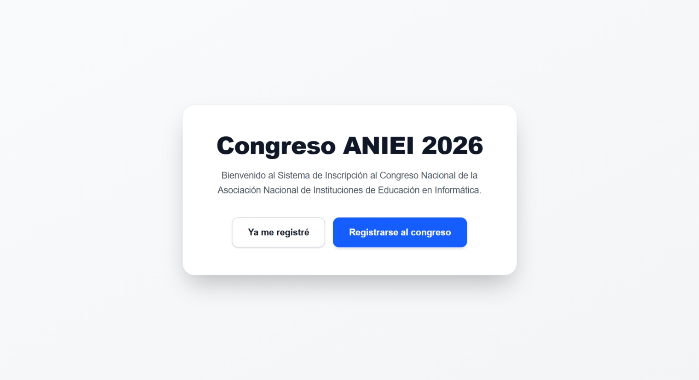
> 📷 **Captura 01:** página principal con el título «Congreso ANIEI 2026» y los
> botones **«Ya me registré»** y **«Registrarse al congreso»**.

---

## 2. Pantalla de inicio

Al abrir la dirección del sistema verás la pantalla de bienvenida con dos opciones:

| Botón | ¿Cuándo usarlo? |
|-------|-----------------|
| **Ya me registré** | Si ya tienes folio y contraseña y quieres iniciar sesión. |
| **Registrarse al congreso** | Si es tu primera vez y aún no tienes cuenta. |

- ¿Es tu primera vez? → pulsa **«Registrarse al congreso»** (sección 3).
- ¿Ya te registraste antes? → pulsa **«Ya me registré»** (sección 4).

> 💡 Si ya iniciaste sesión en otra ocasión, el sistema te llevará directamente a **Mi Perfil**.

---

## 3. Registrarse al congreso

El registro es un **asistente de 3 pasos** que verás en la parte superior de la
pantalla: **1. Datos Generales → 2. Grupo → 3. Pago**. Puedes retroceder a un
paso anterior pulsando sobre su número. Arriba también verás un **total estimado**
que se actualiza conforme agregas integrantes.

Antes de empezar, el sistema muestra un recuadro amarillo con la
**información de costos**: tu costo actual según el tipo de participante y los
próximos cambios de precio por fecha.

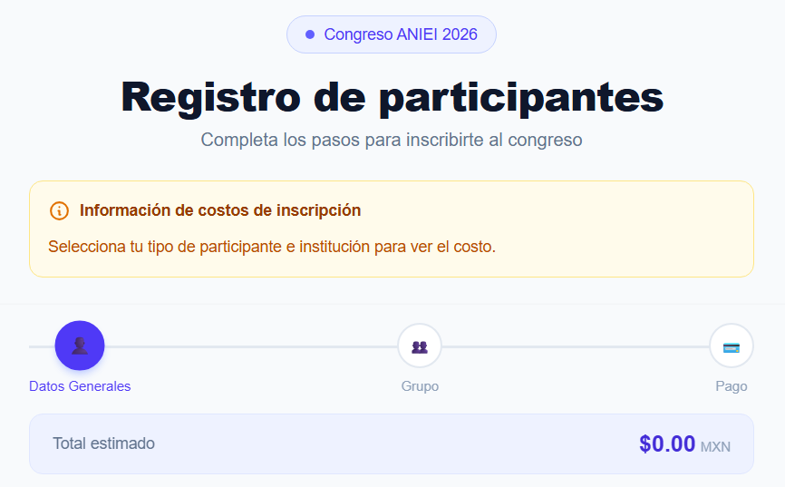
> 📷 **Captura 02:** parte superior del formulario de registro mostrando el
> indicador de pasos (Datos Generales / Grupo / Pago) y el recuadro «Total estimado».

### Paso 1 — Datos Generales

Captura tu información personal e institucional. Los campos marcados con
**\*** son obligatorios.

| Campo | Obligatorio | Notas |
|-------|:-----------:|-------|
| Nombre | ✔ | Tu(s) nombre(s). |
| Apellido | ✔ | Apellido paterno y materno. |
| Correo electrónico | ✔ | Debe ser válido; aquí recibirás tu contraseña. |
| Lada / Teléfono / Extensión | | Opcionales. |
| Género | ✔ | Masculino, Femenino o Prefiero no decirlo. |
| Carrera / Programa | | Opcional. |
| Tipo de participante | ✔ | Alumno, Académico, etc. Determina tu costo. |
| Institución | ✔ | Elígela de la lista. |
| *Mi institución no está afiliada* | | Marca esta casilla si tu institución no aparece; se habilita el campo **«Nombre de la institución»** para escribirla. |
| Facultad / Dependencia | | Opcional. |
| Título | ✔ | Selecciona de la lista. |
| Estado | ✔ | Entidad federativa. |

Al terminar pulsa **«Continuar»**.

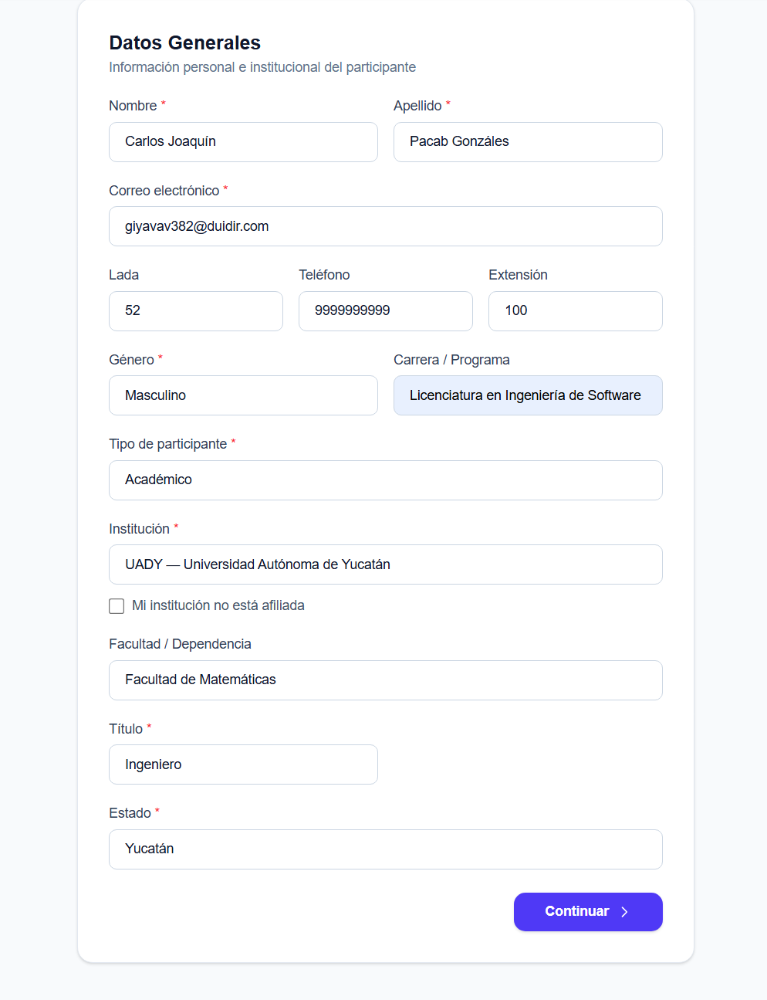
> 📷 **Captura 03:** formulario «Datos Generales» completo, incluyendo la casilla
> «Mi institución no está afiliada».

### Paso 2 — Grupo (opcional)

Si solo te registras tú, **omite este paso** y pulsa **«Continuar»**.

Si registras a otras personas (por ejemplo, un profesor con sus alumnos):

1. Activa el interruptor **«Registro Grupal»**.
2. Pulsa **«Agregar miembro»** por cada persona.
3. Completa de cada integrante: **Nombre\*, Apellido\*, Correo electrónico\* y Tipo\***.
   Cada miembro paga según su tipo de participante y el costo se suma al total.
4. Puedes **«Eliminar»** un integrante si te equivocaste.

> 🎓 **Beneficio:** si agregas **15 alumnos o más**, el profesor responsable
> **no paga inscripción** (aparecerá el aviso «Profesor GRATIS»).

Los correos que captures aquí recibirán después las instrucciones para completar
su propio registro.

Al terminar pulsa **«Continuar»**.

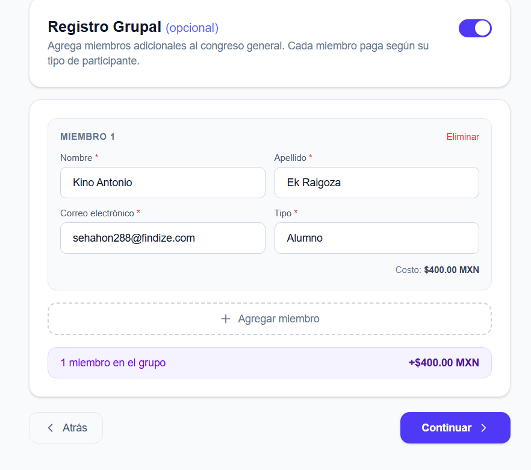
> 📷 **Captura 04:** paso «Grupo» con el interruptor activado y al una
> tarjeta de integrantes agregados.

### Paso 3 — Pago

Verás primero el **Resumen del pago** con el desglose (tu inscripción + miembros

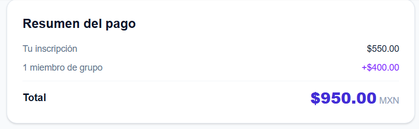
del grupo) y el **Total**.

A continuación captura los **Datos del depósito / transferencia**:

| Campo | Obligatorio | Notas |
|-------|:-----------:|-------|
| Banco / Sucursal | | Opcional (ej. «BBVA Sucursal Centro»). |
| Ciudad | | Opcional. |
| Referencia / Folio del depósito | ✔ | Número de referencia o folio de tu pago. |
| Monto ($MXN) | ✔ | Se llena automáticamente con el total; ajústalo si tu depósito fue distinto. |
| Fecha del depósito | ✔ | Cuándo realizaste el pago. |
| Notas / Observaciones | | Opcional (máx. 500 caracteres). |
| Comprobante de pago | ✔ | Sube la foto o PDF. **PNG, JPG o PDF, máx. 5 MB.** |

**Facturación (opcional):** si necesitas factura, activa el interruptor
**«Facturación»** y llena **Razón social\***, **RFC\***, domicilio fiscal y sube tu
**Constancia de situación fiscal\*** (PNG, JPG o PDF, máx. 5 MB).

Cuando todo esté listo pulsa **«Completar registro»**.

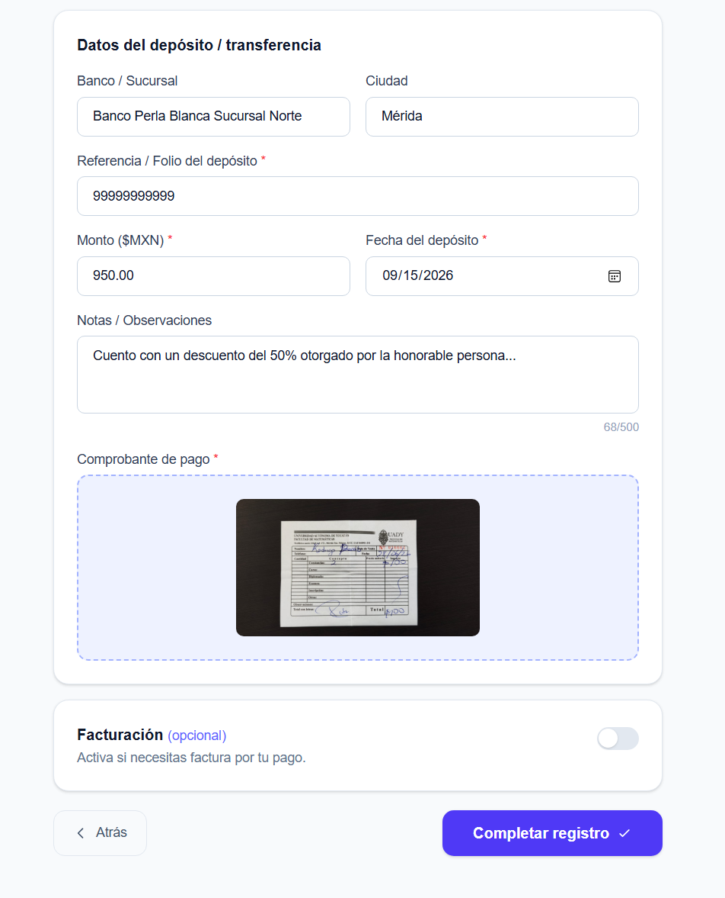
> 📷 **Captura 05:** paso «Pago» mostrando el resumen, los datos del depósito,
> el área para subir el comprobante y el interruptor de Facturación.

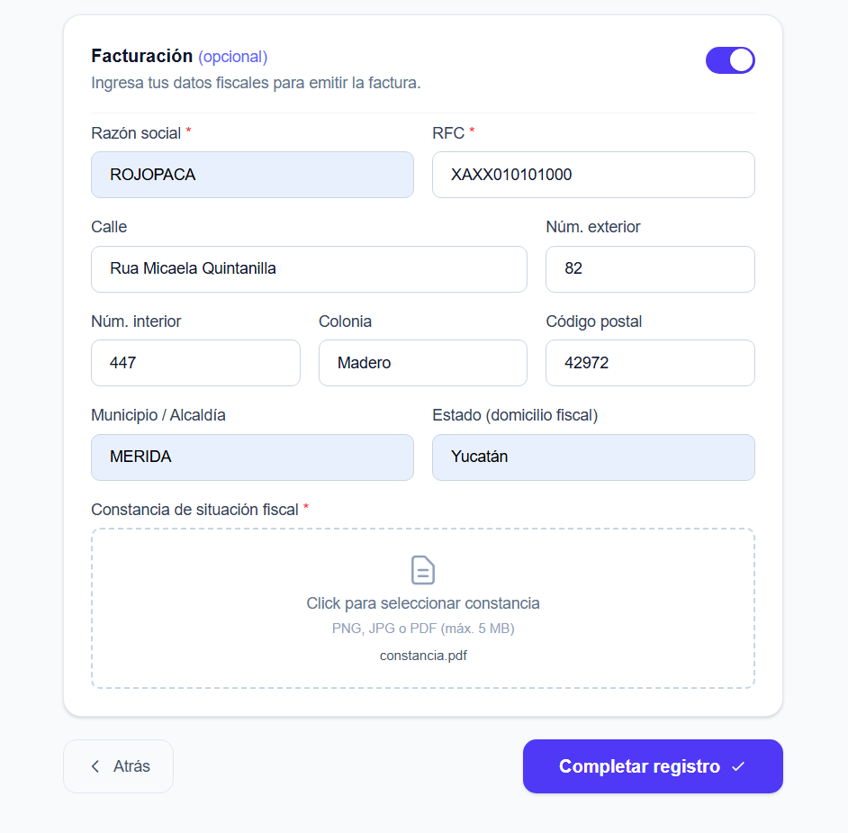

### Confirmación del registro

Al terminar verás la pantalla **«¡Registro exitoso!»** con tu **folio** (formato
`ANI26-XXXX`). **Anótalo y guárdalo**: es tu identificador para iniciar sesión.

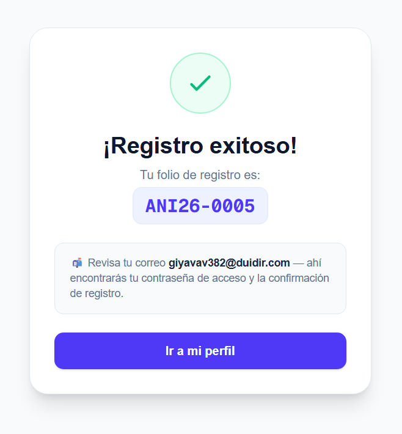
> 📷 **Captura 06:** pantalla «¡Registro exitoso!» destacando el folio
> `ANI26-XXXX` y el aviso de revisar el correo.

### ¿Dónde está mi contraseña?

Tu **contraseña se envía automáticamente al correo** que registraste, junto con
la confirmación. Revisa tu bandeja de entrada y la carpeta de *spam / correo no
deseado*. Con tu **folio + contraseña** ya puedes iniciar sesión (sección 4).

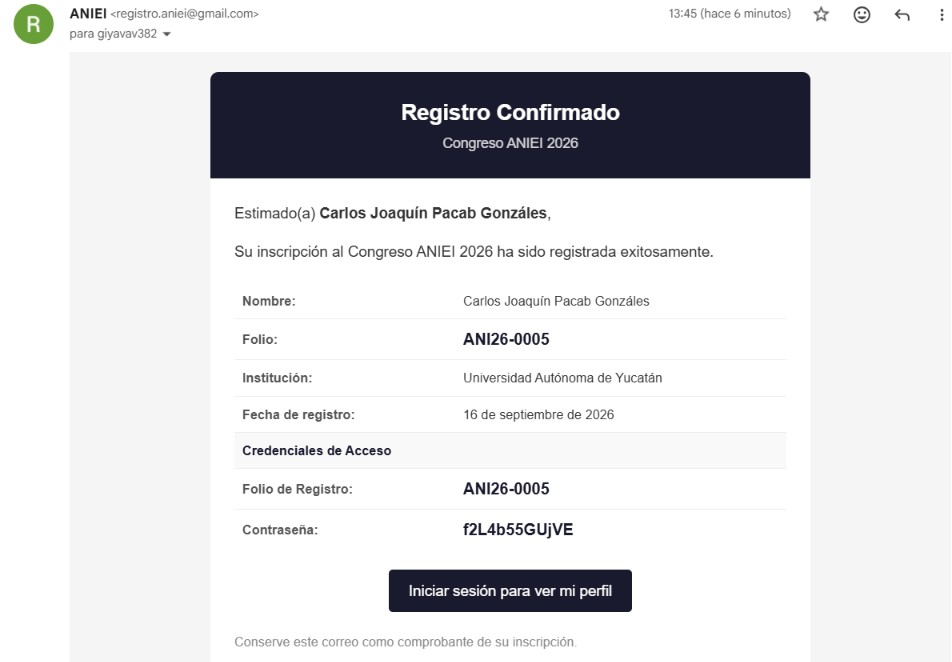

> 🔒 La contraseña se genera por seguridad y se entrega solo por correo. Si no la
> recibes o la pierdes, contacta al administrador del congreso.

---

## 4. Iniciar sesión

Desde la pantalla de inicio pulsa **«Ya me registré»** (o entra directamente a la
pantalla de acceso). Captura:

- **Folio de Registro:** por ejemplo `ANI26-0001`.
- **Contraseña:** la que recibiste por correo.

Pulsa **«Ingresar»**. Si aún no tienes cuenta, usa el botón **«No estoy registrado»**.

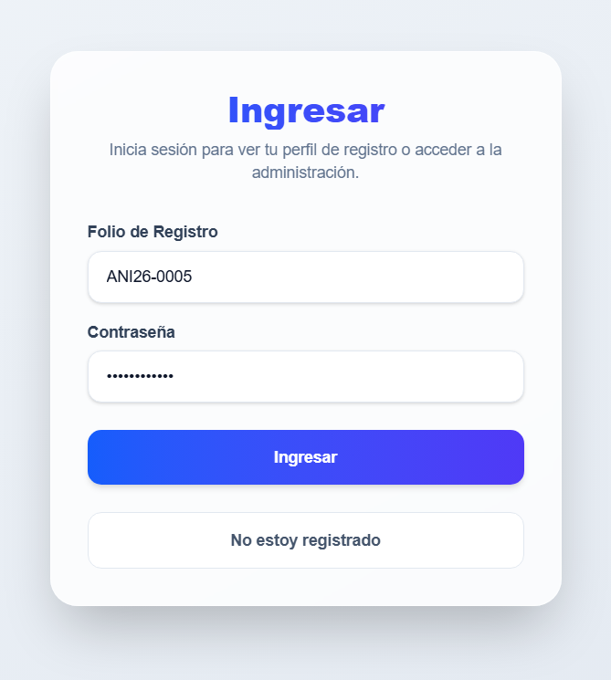
> 📷 **Captura 07:** formulario de acceso con los campos «Folio de Registro»,
> «Contraseña», el botón «Ingresar» y el enlace «No estoy registrado».

> ⚠️ Si el folio o la contraseña son incorrectos, verás un mensaje de error en rojo.
> Verifica los datos e inténtalo de nuevo.

---

## 5. Mi Perfil

Al iniciar sesión entrarás a **Mi Perfil**, tu centro de operaciones. Arriba verás
tu nombre y tu **folio**.

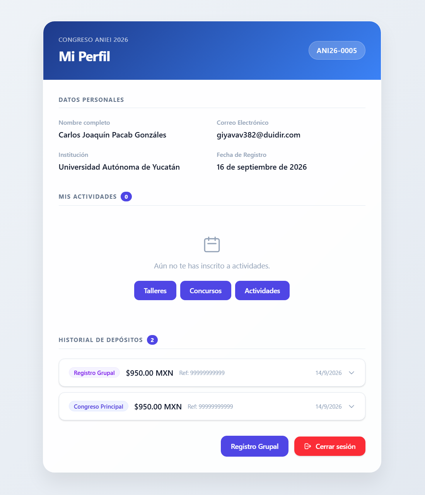
> 📷 **Captura 08:** página «Mi Perfil» completa (Datos personales, Mis Actividades,
> Historial de Depósitos y botones inferiores).

El perfil se divide en:

- **Datos Personales:** nombre, correo, institución y fecha de registro.
- **Mis Actividades:** lista de talleres/actividades a los que ya te inscribiste,
  con tipo, costo, fecha, hora y sede. Si aún no tienes ninguna, verás
  «Aún no te has inscrito a actividades.» y botones para ir a **Talleres**,
  **Concursos** y **Actividades**.
- **Mis Equipos:** si participas en alguna actividad por equipos (concursos/hackatón),
  aquí verás tu equipo y si eres el **Capitán**.
- **Historial de Depósitos:** todos tus pagos. Pulsa una fila para **expandirla** y
  ver el detalle, y usa **«Ver comprobante»** para abrir el archivo que subiste.

En la parte inferior tienes los accesos rápidos:

| Botón | Acción |
|-------|--------|
| **Talleres / Concursos / Actividades** | Ir al catálogo para inscribirte a más actividades. |
| **Registro Grupal** | Registrar a más personas bajo tu cuenta (sección 7). |
| **Cerrar Sesión** | Salir del sistema de forma segura. |

---

## 6. Inscripción a talleres y actividades

Esta es la parte central para apuntarte a los talleres. Puedes entrar desde
**Mi Perfil** con los botones **Talleres**, **Concursos** o **Actividades**, o desde
el menú correspondiente.

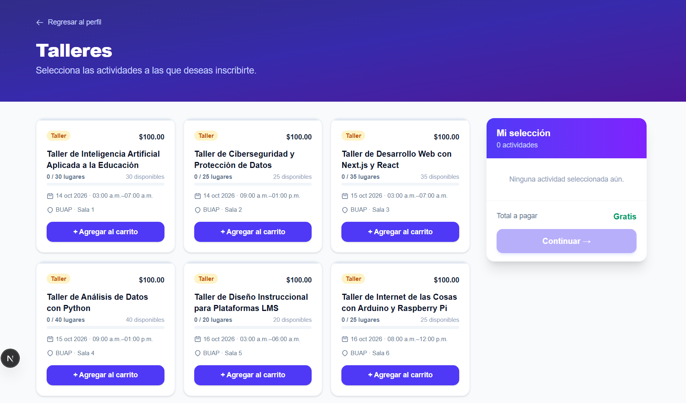
> 📷 **Captura 09:** listado de talleres con varias tarjetas y, a la derecha,
> el panel «Mi selección» (carrito).

### Tipos de actividades

El sistema agrupa las actividades en catálogos independientes:

- **Talleres** — sesiones prácticas (filtro `Talleres`).
- **Concursos** — competencias y hackatones (pueden manejarse por equipos).
- **Actividades** — el resto de las actividades del congreso.

### Paso A — Explorar y seleccionar

Cada actividad se muestra en una **tarjeta** con:

- **Tipo** (etiqueta de color) y **costo** (o la etiqueta **«Gratis»**).
- **Nombre** de la actividad.
- **Indicador de cupo:** una barra con `ocupados / máximo` y «X disponibles».
  Si está llena verás **«🔴 Cupo lleno»** y no podrás seleccionarla.
- **Fecha, hora** y **sede** (institución y sala).
- **Ponentes** (cuando aplique).

Para elegir una, pulsa **«+ Agregar al carrito»**. La tarjeta cambiará a
**«✓ Seleccionado — Quitar»** y se añadirá al panel **«Mi selección»**. Puedes
agregar varias actividades a la vez.

Estados especiales de una tarjeta:

| Estado | Significado |
|--------|-------------|
| **«✓ Ya inscrito»** | Ya estás registrado; no puedes volver a inscribirte. |
| **«Sin lugares disponibles» / «🔴 Cupo lleno»** | No queda cupo; no es seleccionable. |

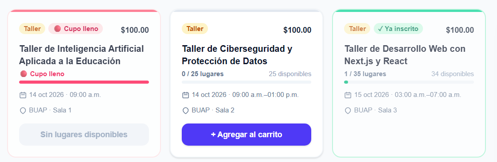
> 📷 **Captura 10:** una tarjeta de taller donde se aprecie el tipo, el costo, la
> barra de cupo y el botón «+ Agregar al carrito».

### Paso B — Revisar el carrito

En el panel **«Mi selección»** (a la derecha en pantallas grandes) verás:

- El **número de actividades** elegidas y su **total a pagar** (o «Gratis»).
- Cada actividad, con una **✕** para quitarla si cambias de opinión.

Cuando estés conforme, pulsa **«Continuar →»**.

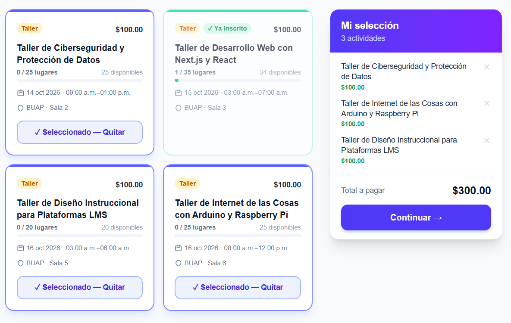
> 📷 **Captura 11:** panel lateral «Mi selección» con actividades agregadas,
> el total y el botón «Continuar →».

### Paso C — Checkout (confirmar inscripción)

Llegarás a la pantalla **«Confirmar Inscripción»**, organizada en secciones:

1. **Resumen de actividades** — la lista de lo que vas a inscribir y el **Total**.
2. **Datos del depósito** — *solo si el total tiene costo*. Captura referencia,
   monto, fecha y sube tu **comprobante** (igual que en el registro: PNG, JPG o PDF,
   máx. 5 MB). Si todas las actividades son **gratis**, esta sección no aparece.
3. **Facturación (opcional)** — actívala si requieres factura.

Revisa todo y pulsa **«Confirmar inscripción»**.

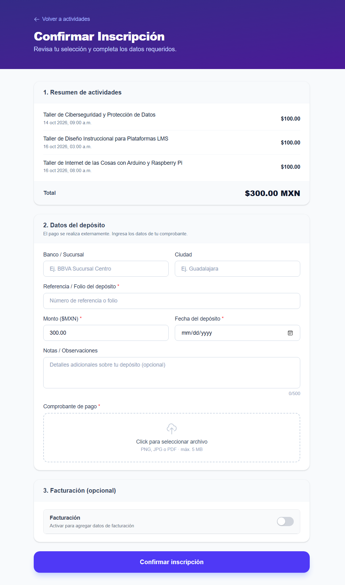
> 📷 **Captura 12:** pantalla «Confirmar Inscripción» con el resumen de actividades,
> los datos del depósito y el botón «Confirmar inscripción».

> ⚠️ **Cupo en tiempo real:** si entre que seleccionaste y confirmaste alguien más
> ocupó los últimos lugares, el sistema te avisará **«Sin cupo disponible en: …»**.
> Regresa, ajusta tu selección y vuelve a intentar.

### Confirmación

Verás la pantalla **«¡Registro Confirmado!»** con tu **folio**, la **lista de
actividades inscritas** y el **total pagado**. También recibirás un **correo de
confirmación**. Pulsa **«Ver mi perfil»** para regresar; tus nuevas actividades ya
aparecerán en **Mis Actividades**.

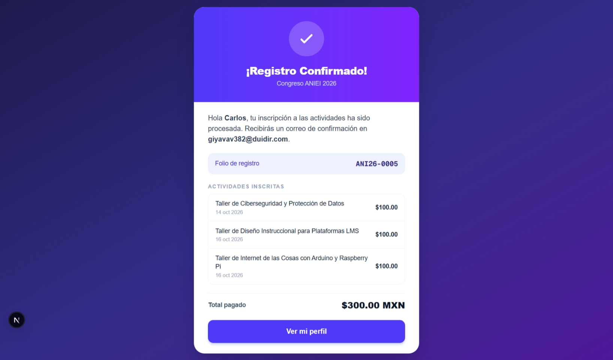
> 📷 **Captura 13:** pantalla «¡Registro Confirmado!» con el folio, las actividades
> inscritas y el botón «Ver mi perfil».

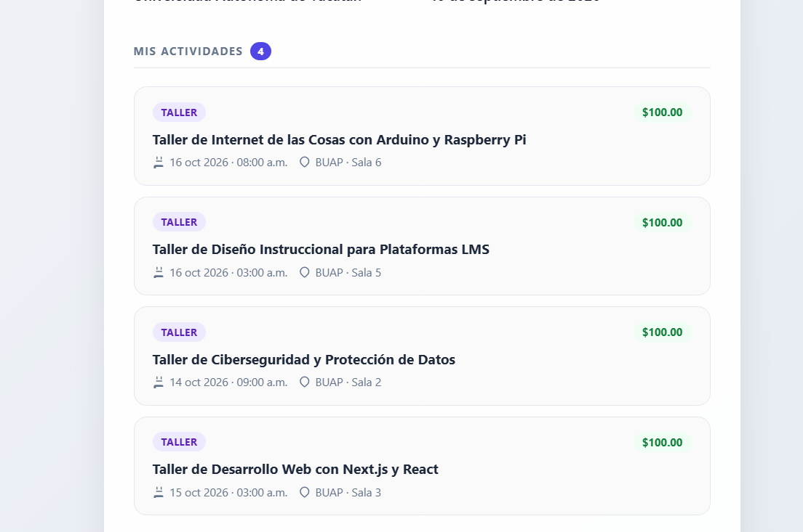

---

## 7. Registro grupal rápido

Si ya tienes tu cuenta y quieres registrar a más personas (por ejemplo, más
alumnos), entra a **Mi Perfil → «Registro Grupal»**. Es un asistente de 3 pasos:

1. **Responsable:** tus datos aparecen precargados (solo lectura). Ten en cuenta que
   los integrantes **heredarán tu Institución, Dependencia, Estado y Tipo de
   Participante**. Pulsa **«Continuar»**.
2. **Integrantes:** activa el interruptor y agrega a cada persona con
   **Nombre\*, Apellido\*, Correo electrónico\* y Tipo\***. Pulsa **«Continuar»**.
3. **Pago:** captura los datos del depósito y sube el **comprobante de pago\***
   (PNG, JPG o PDF, máx. 5 MB). Pulsa **«Completar registro»**.

Al terminar verás **«¡Grupo Registrado!»** con el número de miembros registrados.
Los correos de cada integrante recibirán las instrucciones para completar su
registro.

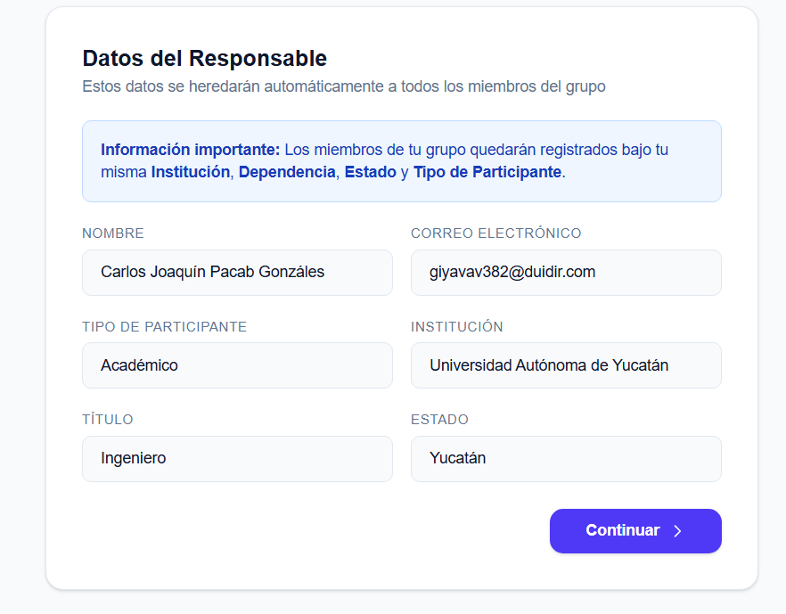
> 📷 **Captura 14:** paso «Integrantes» del registro grupal rápido con el aviso de
> datos heredados y miembros agregados.

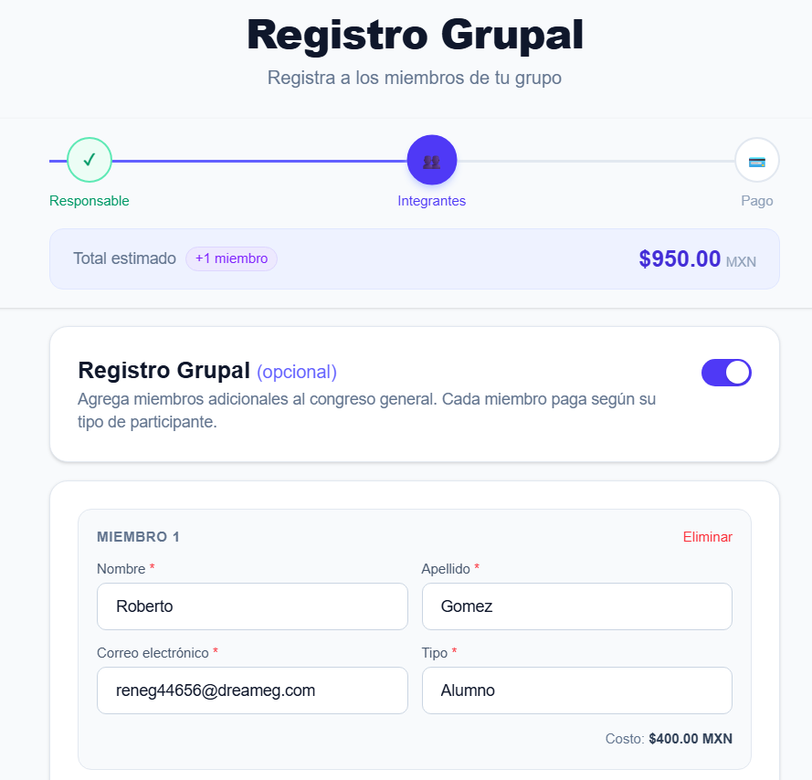

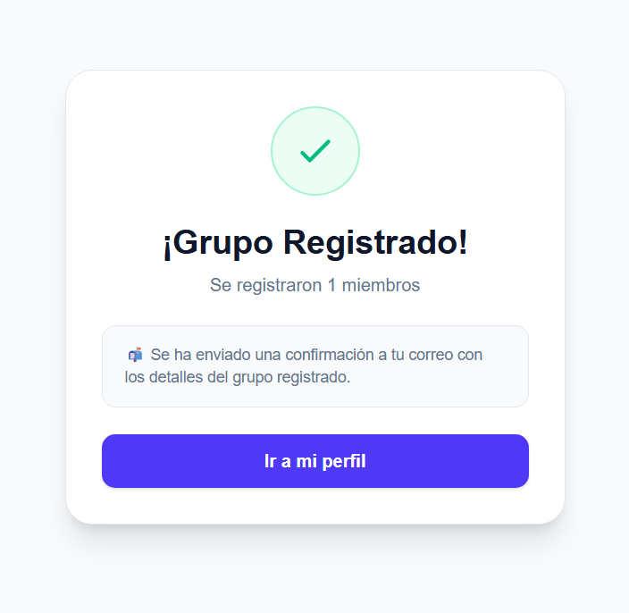

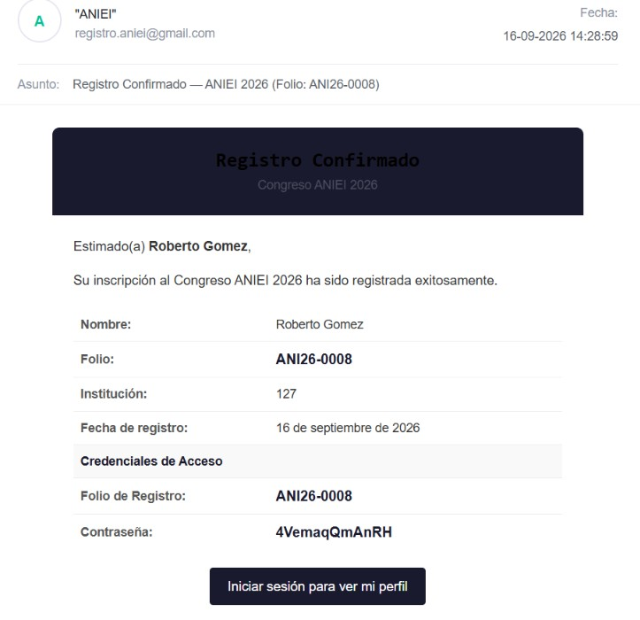

> El usuario hijo que fue registrado se le será enviado sus credenciales para su acceso al sistema y así el mismo podrá inscribirse a talleres y otras actividades.

---

## 8. Cerrar sesión

Cuando termines, pulsa **«Cerrar Sesión»** en la parte inferior de **Mi Perfil**.
Es recomendable cerrar sesión si compartes equipo, para proteger tu folio y datos.

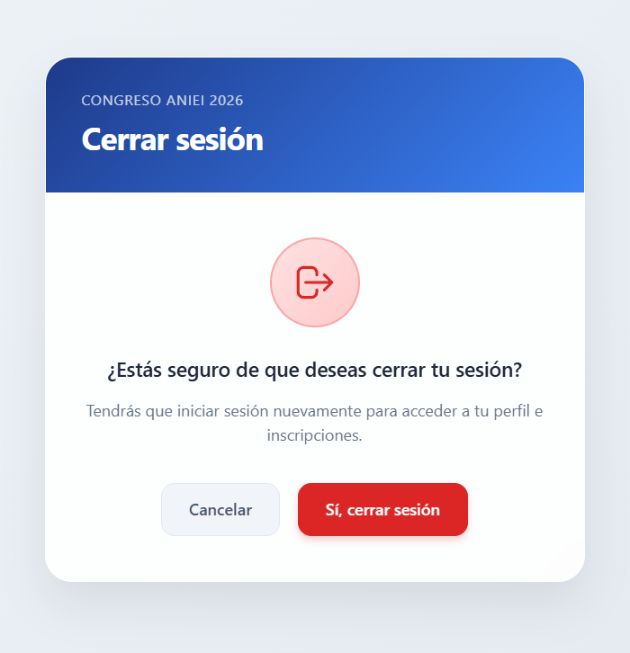
> 📷 **Captura 17:** botones inferiores de Mi Perfil resaltando «Cerrar Sesión».

---

## 9. Formas de pago y comprobantes

- El pago se realiza **externamente** por **depósito o transferencia bancaria**.
- En el sistema **capturas los datos del pago** y **subes el comprobante**.
- **Formatos aceptados:** PNG, JPG o PDF. **Tamaño máximo:** 5 MB por archivo.
- Guarda tu **referencia / folio del depósito**: te sirve para cualquier aclaración.
- El monto se prellena con el total calculado; si tu depósito fue por otra cifra,
  corrígelo para que coincida con tu comprobante.

> ℹ️ La inscripción queda registrada al confirmar, y el comprobante queda disponible
> en **Mi Perfil → Historial de Depósitos** (botón **«Ver comprobante»**).

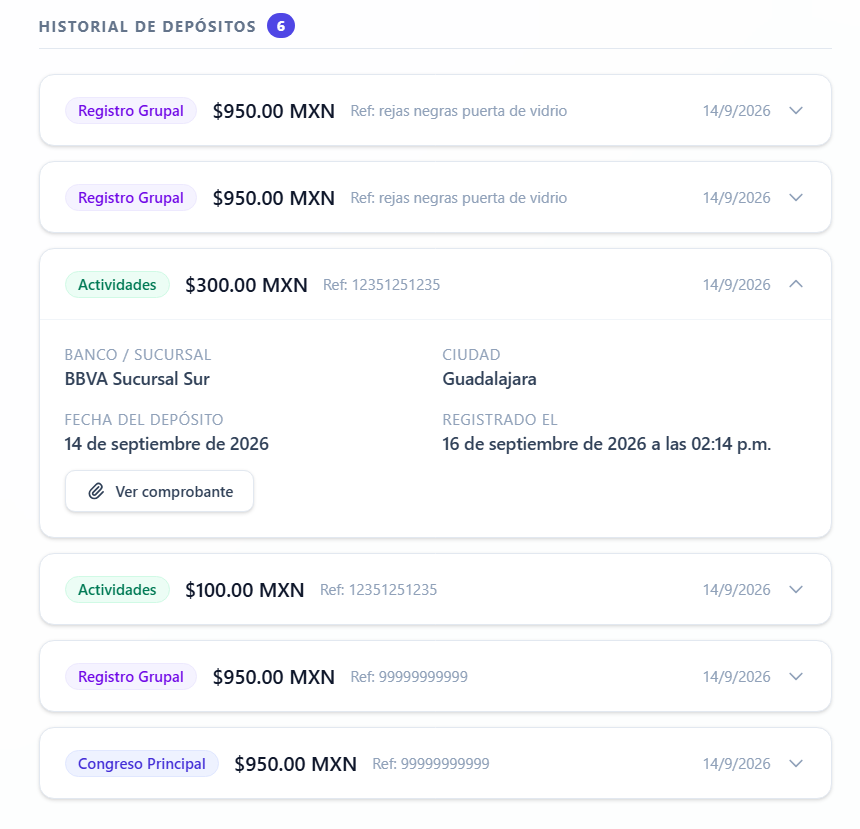

---

## 10. Preguntas frecuentes

**¿No me llegó el correo con la contraseña?**
Revisa la carpeta de *spam / no deseado*. Si no aparece, contacta al administrador
del congreso indicando tu nombre y el correo con el que te registraste.

**Olvidé mi contraseña / perdí mi folio, ¿qué hago?**
El sistema entrega la contraseña por correo al registrarte. Si la perdiste,
solicita apoyo al administrador; no hay restablecimiento automático desde el portal.

**Quise inscribirme a un taller y dice «Sin cupo disponible».**
El cupo se asigna por orden de confirmación. Regresa al catálogo, quita esa
actividad de tu selección y elige otra con lugares disponibles.

**Ya aparezco como «✓ Ya inscrito» en un taller.**
Significa que tu inscripción ya está registrada; la verás en **Mi Perfil → Mis
Actividades**. No es necesario (ni posible) inscribirte dos veces.

**Me equivoqué en un dato del formulario.**
Mientras no hayas enviado, usa **«Atrás»** o pulsa el número del paso para corregir.
Si el error ya se registró, contacta al administrador para solicitar la corrección.

**¿Puedo registrar a varias personas a la vez?**
Sí. Durante tu registro usa el **Paso 2 — Grupo**, o después desde
**Mi Perfil → Registro Grupal** (secciones 3 y 7).

**Subí un comprobante que pesa más de 5 MB y no lo acepta.**
Reduce el tamaño o convierte la imagen a PDF/JPG más ligero y vuelve a intentarlo.
