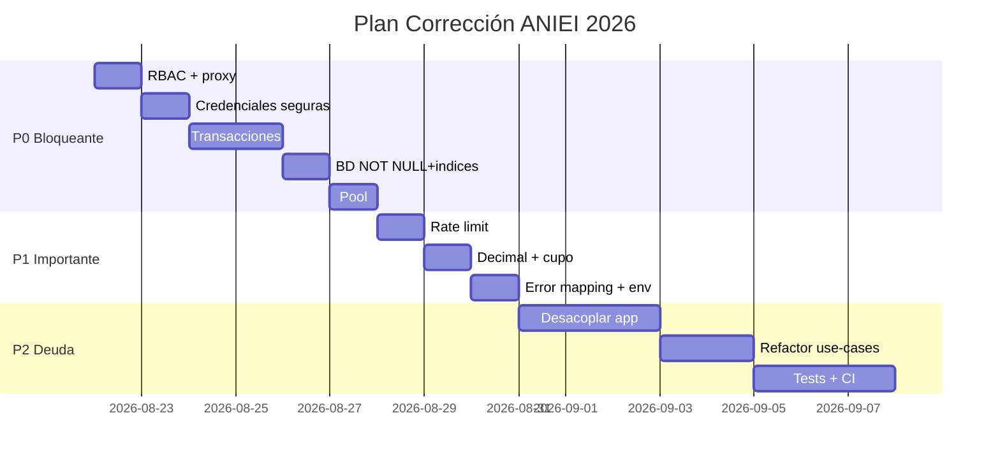

# PLAN DE CORRECCIÓN — Sistema de Registro ANIEI 2026

> **Derivado de:** `docs/AUDITORIA.md` (2026-08-21) y `docs/DESIGN.md` (15 ADRs, 14 ports)  
> **Objetivo:** Cerrar brechas críticas para pasar de “funcional y desplegable” a **apto para producción** con garantía de seguridad, atomicidad y RNF-02.  
> **Alcance:** Acciones correctivas priorizadas P0 (bloqueantes) → P1 (siguiente sprint) → P2 (deuda) con tareas trazables a `file:línea`, criterios de aceptación y verificación.  
> **Convención:** Cada tarea referencia `[AUD-#]` de `AUDITORIA.md` y `DESIGN.md:§`.

---

## Resumen y Principios

| Principio | Aplicación |
|-----------|------------|
| **Seguridad primero** | S-01…S-07 antes que features |
| **Atomicidad antes que perf** | D-05 antes que D-02 |
| **Fijas raíz, no síntoma** | `IPasswordHasher` no solo cambiar `Math.random` |
| **Verificable** | Cada P0 tiene script/test de aceptación |

**Gates:**
- **Gate P0:** No se despliega a prod sin 100% P0 en `main` + `npm run build` y `prisma migrate dev --dry-run` verdes.
- **Gate P1:** Beta cerrada requiere P0+P1.
- **Gate P2:** Release general tras P0+P1+P2 o plan de deuda con fecha.

---

## FASE P0 — Bloqueantes (5–6 días) — *Gate producción*

### P0-1 Seguridad / Auth RBAC — `AUD S-02, S-04, S-05 — DESIGN.md:14, §14.1, ADR-10`

**Objetivo:** Ninguna Server Action `cpanel/*` ejecutable sin `ADMIN` aun si `proxy` se bypassa.

**Tareas:**
- [ x ] **P0-1.1 `requireAdmin()` helper** — `src/shared/auth/requireAdmin.ts:1`
  ```ts
  import { auth } from "@/auth";
  import { getAccesoRepository } from "@/infrastructure/config/container";
  export async function requireAdmin(): Promise<{email:string,folio:string}> {
    const session = await auth();
    if (!session?.user?.email) throw new Error("UNAUTHORIZED");
    const acceso = await getAccesoRepository().buscarPorEmail(session.user.email);
    if (!acceso || acceso.rol.toUpperCase() !== "ADMIN") throw new Error("FORBIDDEN");
    return { email: acceso.email, folio: (session.user as any).folio ?? "" };
  }
  ```
  Añadir `requireUser()` análogo para `perfil/grupo`.
- [ x ] **P0-1.2 Guard en 7 Server Actions** — insertar `await requireAdmin()` al inicio:
  - `src/app/cpanel/actions.ts:8` `getUsuariosAdminAction`, `:21` `reenviarConstanciaAction`, `:38` `obtenerUrlArchivoAction` (éste ya verifica en use-case, reforzar)
  - `src/app/cpanel/actividades/ponentes.actions.ts:27` `buscarUsuariosAction`, `:59` `vincularPonenteAction`, `:72` `desvincularPonenteAction`, `:84` `registrarPonenteAction`
  - `src/app/cpanel/configuracion/actions.ts:9,20,31,44` `guardarPrecioAction` etc., `getTiposActividadAction`
  - `src/app/cpanel/usuarios/[folio]/page.tsx:10` y `src/app/actividades/checkout/actions.ts:24` / `src/app/actividades/actions.ts:34`
- [ x ] **P0-1.3 `proxy.ts` matcher** — `src/proxy.ts:59-68`
  - Cambiar `matcher: '/((?!api|_next/static|...).*)'` a incluir `api` o añadir segundo matcher `/api/:path*`.
  - Alternativa: en cada `src/app/api/**/route.ts` añadir `await auth()` + `requireAdmin()` (si existe).
- [ x ] **P0-1.4 Unificar Rol** — `prisma/schema.prisma:14` → `enum Rol { USER ADMIN }` + `rol Rol @default(USER)`; `src/core/entities/Acceso.ts:27` `isAdmin()` → `rol === Rol.ADMIN`; `src/auth.ts:42` `role: user.rol.toUpperCase() as Rol`; `src/proxy.ts:20,30,41` comparar con `Rol.ADMIN`; migración `ALTER TYPE`.
- [ x ] **P0-1.5 `auth.config.ts:12`** `authorized: () => true` → implementar o documentar que `proxy` es única defensa y añadir test.

**Aceptación:**
- `curl /cpanel` sin cookie → 307 a `/login` (proxy); `POST` a `getUsuariosAdminAction` sin sesión → `FORBIDDEN`.
- `rg "requireAdmin" src/app/cpanel --count` >= 7.
- `prisma/schema.prisma` contiene `enum Rol`.

**Ref AUD:** `AUDITORIA.md:2.1 S-02,S-04,S-05` | `DESIGN.md:14, §14.1`

---

### P0-2 Credenciales Seguras — `AUD S-01,S-06,S-07 — DESIGN.md:17 ADR-12, §8`

**Tareas:**
- [ x ] **P0-2.1 Helper `generateSecurePassword`** — `src/shared/security/password.ts:1`
  ```ts
  import { randomInt } from "crypto";
  const CHARSET = "ABCDEFGHJKLMNPQRSTUVWXYZabcdefghijkmnopqrstuvwxyz23456789!@#";
  export function generateSecurePassword(len=14): string {
    let s=""; for(let i=0;i<len;i++) s+= CHARSET[randomInt(CHARSET.length)];
    return s;
  }
  ```
  14 chars ≈ 84 bits. Tests con `vitest` que `len` y charset no ambiguo.
- [ x ] **P0-2.2 Reemplazar PRNG** — `src/application/use-cases/RegistrarUsuario.ts:70` `Math.random().slice(-8)` → `generateSecurePassword(12)`; `src/app/cpanel/actividades/ponentes.actions.ts:150` idem; `src/app/grupo-completar/[token]/usuario/[idUsuario]/actions.ts:74` idem.
- [ x ] **P0-2.3 Hash único por miembro** — `src/application/use-cases/RegistrarGrupoRapido.ts:58-63` mover `bcrypt.hash(crypto.randomUUID())` dentro del `map` (no reuse `passwordGenerico`).
- [ x ] **P0-2.4 Abstraer hashing** — `src/application/ports/IPasswordHasher.ts:1` `hash(plain):Promise<string>` / `verify`, `src/infrastructure/services/auth/BcryptPasswordHasher.ts:1`; inyectar en `RegistrarUsuario`, `RegistrarGrupoRapido` (corrige `DESIGN.md:8` fuga `import bcrypt` en Application `src/application/use-cases/RegistrarUsuario.ts:3`).
- [ ] **P0-2.5 Dejar de loggear `passwordPlana`** — `src/application/dtos/ResultadoRegistro.ts:1` mantener pero no loggear; `AUDITORIA.md:S-06` plan de fase P1 para flujo `set-password`.

**Aceptación:**
- `rg "Math.random" src --count` == 0.
- `rg "generateSecurePassword" src --count` >= 2.
- Test unitario: 100 passwords tienen 0 colisiones y entropía.

**Ref AUD:** `S-01,S-07` | `DESIGN.md:17 ADR-12`

---

### P0-3 Atomicidad Transaccional — `AUD D-05,D-01 — DESIGN.md:9.2, §16, §15.3`

**Objetivo:** UC-01 y UC-02 atómicos; sin huérfanos `usuarios`/`depositos`/`accesos` ni archivos huérfanos.

**Tareas:**
- [ x ] **P0-3.1 `ITransactionManager` port** — `src/application/ports/ITransactionManager.ts:1` `run<T>(fn: (tx: Prisma.TransactionClient)=>Promise<T>):Promise<T>`; impl `src/infrastructure/database/PrismaTransactionManager.ts:1` delega a `prisma.$transaction`.
- [ x ] **P0-3.2 `RegistrarUsuario` transaccional** — `src/application/use-cases/RegistrarUsuario.ts:35-167`:
  - Envolver `usuarioRepo.crear`, `accesoRepo.crear`, `depositoRepo.crear`, `facturacionRepo.crear`, `inscripcionRepo.crearMuchasConValidacion` en una sola `tx`. Pasar `tx` a repos (sobrecarga `crearTx` o repos reciben `PrismaClient|TransactionClient`).
  - `storage.subir` **antes** de tx con compensación: `try { tx } catch { await storage.eliminar(ruta) }`. Si falla después de subir.
  - Capturar `P2002` (`PrismaClientKnownRequestError.code==="P2002"`) → `RegistroError.CORREO_DUPLICADO`.
- [ x ] **P0-3.3 `RegistrarGrupoRapido` transaccional** — `src/application/use-cases/RegistrarGrupoRapido.ts:40-75` mover `depositoRepo.crear` **dentro** de `crearGrupoTransaccional` (ampliar `crearGrupoTransaccional` para recibir `deposito`); o envolver ambos en `ITransactionManager.run`.
- [ x ] **P0-3.4 `registrar-usuario.action.ts:228-261`** — orquestación `RegistrarUsuario` + `RegistrarGrupoRapido` debe ser un solo `RegistrarUsuarioConGrupoUseCase` transaccional o al menos `try { grupo } catch { compensar usuario }` con log y `rethrow`. Eliminar `console.error` silencioso `:259`.
- [ ] **P0-3.5 `completarRegistroAction:42-104`** — envolver `findUnique emailExistente` + `tx.usuarios.update` + `tx.accesos.update` en `prisma.$transaction` para evitar race `P2002`; mapear `P2002` a `errors.correo`.

**Aceptación:**
- Simulación: matar `depositoRepo.crear` con `throw` → no queda `usuarios` en BD y archivo eliminado.
- Test de concurrencia: 2 registros mismo correo concurrente → uno `CORREO_DUPLICADO` field-level, no `_form` genérico.
- `rg "prisma\.\$transaction" src/application --count` >=1 y `storage.eliminar` en `catch`.

**Ref AUD:** `D-05,D-01` | `DESIGN.md:9.2 postcondición`, `§16`

---

### P0-4 Endurecimiento BD Esquema + Migraciones — `AUD D-01,D-06,D-02,D-03 — DESIGN.md:Apéndice A, §17 ADR-11`

**Tareas:**
- [ x ] **P0-4.1 `folio_registro` NOT NULL** — migración `prisma/migrations/20260821_fix_folio_not_null/migration.sql`:
  ```sql
  ALTER TABLE depositos ALTER COLUMN folio_registro SET NOT NULL;
  ALTER TABLE facturaciones ALTER COLUMN folio_registro SET NOT NULL;
  ALTER TABLE inscripcion_actividades ALTER COLUMN folio_registro SET NOT NULL;
  ALTER TABLE asistencia_actividades ALTER COLUMN folio_registro SET NOT NULL;
  -- accesos.folio_registro queda nullable hasta cerrar ventana dummy (P0-3), luego ver P1
  CREATE INDEX IF NOT EXISTS idx_depositos_folio ON depositos(folio_registro);
  CREATE INDEX IF NOT EXISTS idx_facturaciones_folio ON facturaciones(folio_registro);
  CREATE INDEX IF NOT EXISTS idx_inscripcion_folio ON inscripcion_actividades(folio_registro);
  CREATE INDEX IF NOT EXISTS idx_asistencia_folio ON asistencia_actividades(folio_registro);
  CREATE INDEX IF NOT EXISTS idx_accesos_folio ON accesos(folio_registro);
  CREATE INDEX IF NOT EXISTS idx_usuarios_institucion ON usuarios(id_institucion);
  CREATE INDEX IF NOT EXISTS idx_usuarios_grupo ON usuarios(id_grupo_registro);
  ```
  Actualizar `prisma/schema.prisma:75,120,136,53` `folio_registro String @db.VarChar(15)` sin `?`, y `@@index([folio_registro])` en cada modelo.
- [ x ] **P0-4.2 Secuencia + migración base** — crear `prisma/migrations/` y `CREATE SEQUENCE IF NOT EXISTS usuarios_folio_seq OWNED BY usuarios.folio_registro;` parametrizar prefijo: `CREATE OR REPLACE FUNCTION gen_folio() ...` o documentar `ANI26` hardcode y plan año. `prisma/schema.prisma:171` añadir comentario.
- [ x ] **P0-4.3 Índices búsqueda** — `CREATE EXTENSION IF NOT EXISTS pg_trgm; CREATE INDEX idx_usuarios_search_trgm ON usuarios USING GIN ((nombre||' '||apellido||' '||correo) gin_trgm_ops);` para `PrismaAdminQueryService.ts:19 contains mode:insensitive`.
- [ ] **P0-4.4 `onDelete` política** — decidir y documentar en `DESIGN.md:15.3` “Retención financiera”: `usuarios` → `depositos/facturaciones/inscripciones` `onDelete: Restrict` (no `Cascade`); `equipo_integrantes.usuarios` uniformizar a `Restrict`. Generar migración `ALTER TABLE ... DROP CONSTRAINT ... ADD CONSTRAINT ... ON DELETE RESTRICT`.

**Aceptación:**
- `prisma migrate dev --dry-run` verde, `prisma db pull` refleja `NOT NULL` e índices.
- `EXPLAIN SELECT * FROM depositos WHERE folio_registro='ANI26-0001'` usa `Index Scan`.
- `DELETE FROM usuarios WHERE folio_registro='...'` con depósitos falla `Restrict`.

**Ref AUD:** `D-01,D-02,D-03,D-06` | `DESIGN.md:Apéndice A`

---

### P0-5 Pool y Cliente BD — `AUD D-07 — DESIGN.md:15.2, §15`

**Tareas:**
- [ x ] **P0-5.1 `src/infrastructure/database/client.ts:11-24`**:
  ```ts
  if (!process.env.DATABASE_URL) throw new Error("DATABASE_URL falta");
  const pool = globalForPrisma.pool ?? new Pool({
    connectionString: process.env.DATABASE_URL,
    max: 10, idleTimeoutMillis: 10000, connectionTimeoutMillis: 5000, maxUses: 7500,
    ssl: process.env.DATABASE_URL.includes("supabase") ? { rejectUnauthorized:false } : undefined,
  });
  pool.on("error", e => console.error("pg pool error", e));
  // cache siempre, no solo dev
  globalForPrisma.pool = pool; globalForPrisma.prisma = prisma;
  ```
- [ ] **P0-5.2 Env fail-fast** — `src/infrastructure/config/container.ts:63-84` validar env en import (zod `envSchema`) en vez de en cada getter.

**Aceptación:**
- `NODE_ENV=production node -e "import('./src/infrastructure/database/client.ts')"` no crea segundo pool.
- `DATABASE_URL="" npm run build` falla temprano con mensaje claro.

---

## FASE P1 — Importantes (1–2 semanas) — *Beta cerrada*

### P1-1 Rate Limit Login — `AUD S-03 — DESIGN.md:14.1`

- [ ] **P1-1.1** `npm i @upstash/ratelimit @upstash/redis` o `rate-limiter-flexible` inmemory (Vercel KV).
- [ ] **P1-1.2** `src/auth.ts:16 authorize` wrapper `ratelimit.limit(email+ip)` con 5 intentos / 15min, `throw new Error("RATE_LIMIT")`.
- [ ] **P1-1.3** `src/auth.config.ts:5` `session: { maxAge: 8*3600, updateAge: 3600 }`, `src/app/login/actions.ts:7` normalizar `email.trim().toLowerCase()`, `zod` login schema.
- [ ] **P1-1.4** Añadir captcha (Turnstile) tras 3 fallos.

**Aceptación:** 6 intentos fallidos → `429` y mensaje “intente en 15min”.

---

### P1-2 Precisión Decimal — `AUD D-04 — DESIGN.md:16.3`

- [ ] **P1-2.1** `src/infrastructure/mappers/DepositoMapper.ts:13` → `monto: new Prisma.Decimal(raw.monto.toFixed(2))` o `raw.monto.toString()`; `PrismaAdminQueryService.ts:58` `Number(dep.monto)` → `Number(dep.monto.toFixed(2))`; `src/shared/...` mantener `Monto` con `Decimal` o `number` con `toFixed`.
- [ ] **P1-2.2** `prisma/schema.prisma` añadir `@@check` o al menos `Monto.create` validar `>=0` y escala 2.
- [ ] **P1-2.3** Tests redondeo `0.1+0.2`.

---

### P1-3 Índices y `cupo_maximo` semántica — `AUD D-02, §13`

- [ ] **P1-3.1** Completar índices `@@index` en `actividades(id_tipo_actividad,id_institucion_sede)`, `equipo_integrantes(id_equipo)`.
- [ ] **P1-3.2** `prisma/schema.prisma:35` `cupo_maximo Int?` sin `@default(0)`; `0` → error, `null` → ilimitado. Migrar y actualizar `PrismaInscripcionActividadRepository.ts:82` y `DESIGN.md:13.6`. Añadir `CHECK (cupo_maximo IS NULL OR cupo_maximo>0)`.

---

### P1-4 Error Mapping + Observabilidad — `AUD 2.4`

- [ x ] **P1-4.1** `src/infrastructure/errors/prismaErrorMapper.ts:1` mapea `P2002→RegistroError.CORREO_DUPLICADO`, `P2003→ComprobanteError.TIPO_NO_PERMITIDO`, `P2025→GrupoRegistroError.GRUPO_VACIO`.
- [ x ] **P1-4.2** `src/app/registro/actions/registrar-usuario.action.ts:310` usar mapper en vez de `includes('RFC')`.
- [ ] **P1-4.3** `pino` logger + `Sentry` init en `src/infrastructure/observability/`.

---

### P1-5 Env y Storage — `AUD 2.5`

- [ ] **P1-5.1** `src/shared/env.ts:1` `z.object({ DATABASE_URL: z.string().url(), GMAIL_USER: z.string().email(), ... }).parse(process.env)` fail-fast en `container.ts:1`.
- [ ] **P1-5.2** `src/infrastructure/services/storage/SupabaseStorageService.ts:12` `resolveBucket(path)` con map `const BUCKETS={constancias:'constancias', comprobantes:'comprobantes', 'comprobantes_grupo':'comprobantes'}`.

---

## FASE P2 — Deuda y Arquitectura (2–4 semanas) — *Release general*

### P2-1 Desacoplar `app/` de `prisma` — `AUD §4, C-01 — DESIGN.md:4 RNF-02`

- [ ] **P2-1.1** Nuevos ports: `IUsuarioQuery`, `IGrupoRepository`, `IInscripcionQuery`; use-cases `ObtenerPerfilUseCase`, `ListarGrupoPendienteUseCase`, `ObtenerDepositosPorUsuarioUseCase`.
- [ ] **P2-1.2** Refactor `src/app/perfil/page.tsx:3,17,36,52`, `src/app/grupo-completar/[token]/page.tsx:2`, `src/app/cpanel/usuarios/[folio]/page.tsx:14` para usar use-cases + `container.ts`.
- [ ] **P2-1.3** Eliminar `import { prisma }` de `app/` (regla `eslint` `no-restricted-imports`).

**Aceptación:** `rg "from '@/infrastructure/database/client'" src/app --count` == 0; cambiar a `Drizzle` solo toca `infrastructure/`.

---

### P2-2 Refactor God Use-Case + Validación Única — `AUD C-01,C-02`

- [ ] **P2-2.1** Split `RegistrarUsuario.ts:22` 8 deps → `CrearUsuarioUseCase` (tx) + `GenerarConstanciaUseCase` + orquestador `RegistrarUsuarioOrchestrator`.
- [ ] **P2-2.2** `ArchivoComprobante.Constraints` expone `MIMES, MAX 5MB` usado por `registro.schema.ts:46` y `src/app/perfil/grupo/registro/actions.ts:36` (eliminar duplicado).
- [ ] **P2-2.3** `IIdGenerator` (`crypto.randomUUID`) y `IPasswordHasher` ports.

---

### P2-3 Dominio y Mappers — `AUD C-03, D-04`

- [ ] **P2-3.1** `UsuarioMapper.ts:20-22` `??0` → preservar `null` y `UsuarioProps` con `idTitulo: number|null`; VO `IdTitulo`, `Rol`.
- [ ] **P2-3.2** `GrupoRegistro.obtenerTodos/obtenerNuevosRegistros` unificar o eliminar muerto.
- [ ] **P2-3.3** `GenerarConstanciaPonente/Participante` DRY (factory template).

---

### P2-4 Testing & CI — `AUD 2.4`

- [ ] **P2-4.1** `vitest` + `npm i -D vitest @vitest/coverage` con suites: `Monto`, `Email`, `ArchivoComprobante`, `RegistrarUsuario` (mock ports), `PrismaInscripcionActividadRepository FOR UPDATE` (testcontainers).
- [ ] **P2-4.2** `npm run test:ci` y `prisma migrate diff` en CI que falla si `DESIGN.md:Apéndice A` desactualizado.
- [ ] **P2-4.3** Headers `next.config.ts:headers` CSP/HSTS, `trustHost:true` en `auth.config.ts`.

---

## Cronograma Propuesto



**Esfuerzo total:** P0 5.5d + P1 3d + P2 8d = **16.5 días-persona** (1 dev senior; 8 días con 2 devs en paralelo P0/P1).

---

## Seguimiento y Verificación

| Fase | Gate | Comando verificación | Evidencia |
|------|------|----------------------|-----------|
| P0 | RBAC | `rg requireAdmin src/app/cpanel --count` + `npx tsc --noEmit` | Logs `FORBIDDEN` |
| P0 | PRNG | `rg "Math.random" src` | 0 resultados |
| P0 | Tx | `npm run test -- RegistrarUsuario` + kill `depositoRepo` | Sin huérfanos |
| P0 | BD | `prisma migrate dev` + `EXPLAIN` | `Index Scan` |
| P0 | Pool | `NODE_ENV=production npm run build` | No leak |
| P1 | Rate | `for i in {1..6}; do curl -X POST /api/auth/callback/credentials; done` | 429 en 6º |
| P2 | Decoupling | `rg "prisma" src/app --count` | 0 |
| P2 | CI | `npm run test:ci` + `prisma migrate diff` | verde |

**Tablero sugerido (GitHub Projects):** columnas `Backlog → P0 → P1 → P2 → Done`, label `AUD-S-02`, `AUD-D-05`, link a `AUDITORIA.md:§`.

---

## Riesgos Residuales y Mitigación

| Riesgo | Mitigación P0/P1 | Plan B |
|--------|------------------|--------|
| Migración `NOT NULL` falla por datos sucios (`folio_registro null`) | `UPDATE depositos SET folio_registro='MIGRADO-'||id WHERE null` antes | `SET NOT NULL` con `USING` |
| `onDelete Restrict` bloquea borrado admin legítimo | Soft-delete `deletedAt` + `where: {deletedAt:null}` | Mantener `Cascade` con auditoría trigger |
| `pg_trgm` no disponible en Supabase free | Fallback `ILIKE` sin índice, documentar | `supabase` enable extension |

---

## Referencias

- `docs/AUDITORIA.md:1-251` — fuente de hallazgos `S-01…C-04,D-01…D-07`
- `docs/DESIGN.md:1-1840` — §4 RNF-02, §7 dominio, §8 ports, §9 UC-01/02, §14 auth, §15 container, §16 mappers, Apéndice A/B
- `prisma/schema.prisma:1-221` — esquema base
- `src/auth.ts:16`, `src/proxy.ts:59`, `src/application/use-cases/RegistrarUsuario.ts:70` — hotspots

---

*Plan generado para ejecución inmediata. Actualizar `DESIGN.md:17 ADRs` con ADR-16 (Transacción atómica) y ADR-17 (RBAC Server Actions) al cerrar P0.*
