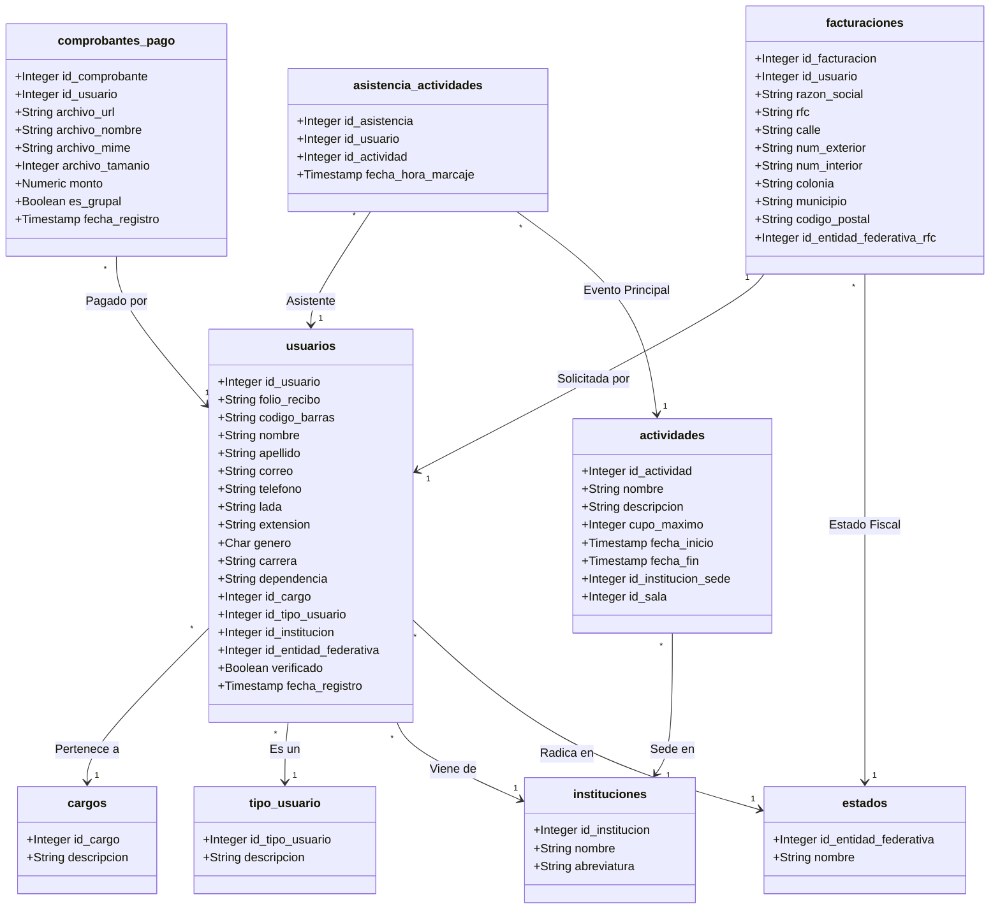

```mermaid

classDiagram
    %% Catálogos
    class cargos {
        +Integer id_cargo
        +String descripcion
    }

    class estados {
        +Integer id_entidad_federativa
        +String nombre
    }

    class instituciones {
        +Integer id_institucion
        +String nombre
        +String abreviatura
    }

    class tipo_usuario {
        +Integer id_tipo_usuario
        +String descripcion
    }

    %% Tablas Principales
    class usuarios {
        +Integer id_usuario
        +String folio_recibo
        +String codigo_barras
        +String nombre
        +String apellido
        +String correo
        +String telefono
        +String lada
        +String extension
        +Char genero
        +String carrera
        +String dependencia
        +Integer id_cargo
        +Integer id_tipo_usuario
        +Integer id_institucion
        +Integer id_entidad_federativa
        +Boolean verificado
        +Timestamp fecha_registro
    }

    class actividades {
        +Integer id_actividad
        +String nombre
        +String descripcion
        +Integer cupo_maximo
        +Timestamp fecha_inicio
        +Timestamp fecha_fin
        +Integer id_institucion_sede
        +Integer id_sala
    }

    class asistencia_actividades {
        +Integer id_asistencia
        +Integer id_usuario
        +Integer id_actividad
        +Timestamp fecha_hora_marcaje
    }

    class comprobantes_pago {
        +Integer id_comprobante
        +Integer id_usuario
        +String archivo_url
        +String archivo_nombre
        +String archivo_mime
        +Integer archivo_tamanio
        +Numeric monto
        +Boolean es_grupal
        +Timestamp fecha_registro
    }

    class facturaciones {
        +Integer id_facturacion
        +Integer id_usuario
        +String razon_social
        +String rfc
        +String calle
        +String num_exterior
        +String num_interior
        +String colonia
        +String municipio
        +String codigo_postal
        +Integer id_entidad_federativa_rfc
    }

    %% Relaciones de Usuarios con Catálogos
    usuarios "*" --> "1" cargos : Pertenece a
    usuarios "*" --> "1" tipo_usuario : Es un
    usuarios "*" --> "1" instituciones : Viene de
    usuarios "*" --> "1" estados : Radica en

    %% Relaciones Operativas
    comprobantes_pago "*" --> "1" usuarios : Pagado por
    facturaciones "1" --> "1" usuarios : Solicitada por
    facturaciones "*" --> "1" estados : Estado Fiscal

    %% Relaciones de Asistencia
    asistencia_actividades "*" --> "1" usuarios : Asistente
    asistencia_actividades "*" --> "1" actividades : Evento Principal
    actividades "*" --> "1" instituciones : Sede en

```